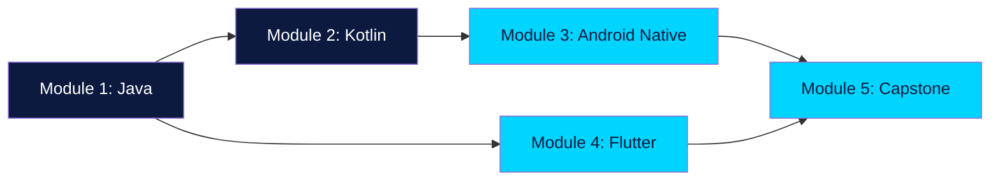

<h1 align="center">Mobile App Development Course</h1>

<p align="center">
  <b>A complete, beginner-friendly course on building production mobile apps.</b><br/>
  Java foundations · Kotlin · Android Native (XML + Jetpack Compose) · Flutter
</p>

<p align="center">
  <a href="https://mazen-salah.github.io/Mobile-application-development-course-content/"></a>
  <a href="https://github.com/mazen-salah/Mobile-application-development-course-content/stargazers"></a>
  <a href="LICENSE"></a>
</p>

<p align="center">
  <a href="https://mazen-salah.github.io/Mobile-application-development-course-content/01-java-foundations/"></a>
  
  
  
  
  
  
</p>

---

## 👉 [Read the live course at the site](https://mazen-salah.github.io/Mobile-application-development-course-content/)

The site is the recommended way to read this course — it has search, syntax highlighting, interactive diagrams, dark mode, and a clean reading experience.

This README is a quick overview for browsing on GitHub.

---

## What this course covers

By the end you'll be able to ship a real Android app **and** a real cross-platform Flutter app.



### Module breakdown

| # | Module | Lessons | What you build |
|---|---|---|---|
| 1 | [Java Foundations](docs/01-java-foundations/) | 18 + 4 labs | Programming from zero: variables, OOP, collections, exceptions |
| 2 | [Kotlin](docs/02-kotlin/) | 12 + 2 labs | Modern Android's language: null safety, lambdas, data classes |
| 3 | [Android Native](docs/03-android-native/) | 13 + 3 labs | Activities, layouts, RecyclerView, ViewModel, Room, Retrofit, Compose |
| 4 | [Flutter](docs/04-flutter/) | 13 + 3 labs | Widgets, navigation, BLoC, HTTP, persistence, Firebase, publishing |
| 5 | [Capstone](docs/05-capstone/) | 2 project briefs | Ship **TaskMate** — a real app to the Play Store |

**Total: ~70 lessons, ~14 labs, 2 capstone tracks. Estimated 120-200 hours.**

---

## Who this is for

- **Complete beginners** with no programming background — start at Module 1
- **Java/Python developers** new to mobile — start at Module 2 or 3
- **Native devs** wanting to learn Flutter — skim Modules 1-3, focus on Module 4
- **Web developers** transitioning to mobile — start at Module 4 (Flutter is closest to React's mental model)

No prior mobile experience required.

---

## Course structure

Every lesson follows the same format:

1. **Concept** — what it is and why it matters
2. **Example** — runnable code you can paste into your IDE
3. **Try it yourself** — a small exercise with a hidden solution
4. **Common mistakes** — what beginners get wrong

Labs at the end of each module ask you to combine several concepts into a working mini-app.

---

## Setup

- **Module 1**: JDK 21+ and VS Code (Extension Pack for Java)
- **Module 2**: IntelliJ IDEA Community Edition
- **Module 3**: Android Studio (latest) + emulator or real Android device
- **Module 4**: Flutter SDK + Android Studio or VS Code

Full setup instructions in the [Getting Started guide](docs/getting-started.md).

---

## Build the site locally

The site is built with [MkDocs Material](https://squidfunk.github.io/mkdocs-material/).

```bash
pip install -r requirements.txt
mkdocs serve
# open http://localhost:8000
```

To produce the static HTML for deployment:

```bash
mkdocs build
```

A GitHub Actions workflow auto-deploys to GitHub Pages on push to `main`.

---

## Contributing

This course is open source under MIT. Contributions welcome:

- **Found a typo or unclear explanation?** [Open a PR](https://github.com/mazen-salah/Mobile-application-development-course-content/pulls).
- **Found a bug in a code example?** Open a PR with the fix.
- **Want to add a lesson?** Open an issue first to discuss scope.
- **Translated a lesson?** Open an issue — I'd love to add multi-language support.

See [CONTRIBUTING.md](CONTRIBUTING.md) for details.

---

## Author

**Mazen Tamer Salah** — Founder of [SummationWorks](https://summationworks.com), Technical Team Lead at [UTD Software](https://utdsoftware.com) and [Clean Basket](https://clean-basket.com).

Based in Alexandria, Egypt. I've been building mobile apps for years and teaching this material to junior engineers across MENA.

- 🌐 [summationworks.com](https://summationworks.com)
- 💼 [LinkedIn](https://linkedin.com/in/mazen3056)
- 📧 [mazentamer3056@gmail.com](mailto:mazentamer3056@gmail.com)

---

## License

MIT — see [LICENSE](LICENSE). Use, modify, redistribute. If you teach from this material, a credit is appreciated.

---

<p align="center">
  <b>If this helps you, please ⭐ star the repo</b> — it's the best signal that the work is worth continuing.
</p>
