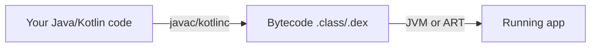

# Introduction to Programming & Java

## What programming actually is

A computer is a stack of layers. At the bottom: transistors that flip between 0 and 1. At the top: you typing words into an editor. A **programming language** is what lets a human at the top describe instructions that eventually become transistor flips at the bottom.

| Layer | Language | Who reads it |
|---|---|---|
| Hardware | Machine code (`10110000`) | CPU |
| Low-level | Assembly (`MOV AL, 61h`) | Compilers & humans (rarely) |
| High-level | Java, Kotlin, Dart, Python, C++ | **You** |
| Domain-specific | SQL, HTML, CSS | You, for specific tasks |

Java sits in the high-level layer. You write Java; the **Java compiler** translates it to **bytecode**; the **JVM (Java Virtual Machine)** runs the bytecode on whatever OS you're on.

## Why this matters for Android

Android apps run on the **Android Runtime (ART)**, a JVM-like environment. Whether you write Java or Kotlin, the output is bytecode that ART executes on the user's phone.



## Why Java first

Java forces you to be explicit. Every variable has a declared type. Every method has a return type. Every class is in its own file. This strictness is annoying as a beginner but invaluable when you graduate to:

- **Kotlin** — relaxes Java's rules, but you need to know what's being relaxed
- **Android** — built on the JVM model
- **Production codebases** — every senior engineer reads Java fluently

## What you'll write today

```java
public class HelloWorld {
    public static void main(String[] args) {
        System.out.println("Hello, World!");
    }
}
```

In the next lesson you'll run that exact program. By the end of this module you'll write 18 different programs, each progressively more sophisticated.

## Common beginner mistake

> "I'll just copy-paste examples and figure it out."

**Don't.** Type every example by hand. The friction of typing — and the typos you'll inevitably introduce — is the entire point. Debugging your own typos teaches you how the language reacts to mistakes.

[Next: Output & Hello World →](02-output.md)
