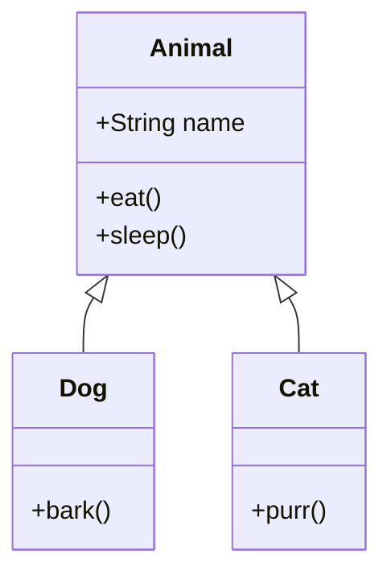

# OOP — Inheritance

**Inheritance** lets one class reuse the fields and methods of another. The new class is a *specialized* version of the original.



## extends

```java
public class Animal {
    String name;

    public void eat() {
        System.out.println(name + " is eating");
    }

    public void sleep() {
        System.out.println(name + " is sleeping");
    }
}

public class Dog extends Animal {
    public void bark() {
        System.out.println(name + " says woof");
    }
}
```

`Dog extends Animal` means `Dog` automatically has `name`, `eat()`, and `sleep()` — plus its own `bark()`.

```java
Dog d = new Dog();
d.name = "Rex";
d.eat();    // Rex is eating  (inherited)
d.sleep();  // Rex is sleeping (inherited)
d.bark();   // Rex says woof   (own method)
```

## Why use inheritance

When two classes share lots of behavior — but one needs *extra* — extract the common part into a parent (often called **base class** or **superclass**).

- `EmployeePerson` and `CustomerPerson` both share `name`, `email`, `phone` → put them in `Person`
- `RectangleShape` and `CircleShape` both need `area()` and `perimeter()` → put declarations in `Shape`

## super — calling the parent

If a child overrides a parent method, it can still call the parent version:

```java
public class Animal {
    public void greet() {
        System.out.println("Hello, I'm an animal");
    }
}

public class Dog extends Animal {
    @Override
    public void greet() {
        super.greet();  // call parent first
        System.out.println("I'm also a dog");
    }
}

new Dog().greet();
// Hello, I'm an animal
// I'm also a dog
```

The `@Override` annotation tells the compiler "I'm intentionally replacing the parent method." It catches typos — if you misspell the method name, the compiler errors out.

## Constructors and inheritance

A child must call a parent constructor (implicitly the no-arg one, or explicitly via `super(...)`):

```java
public class Animal {
    String name;

    public Animal(String name) {
        this.name = name;
    }
}

public class Dog extends Animal {
    String breed;

    public Dog(String name, String breed) {
        super(name);       // call parent constructor
        this.breed = breed;
    }
}
```

If the parent has no default (no-arg) constructor, the child **must** call `super(...)` first thing in its constructor.

## Single inheritance

A Java class can `extend` **only one** parent. (Multiple inheritance is done via interfaces — covered in Module 2.) This avoids the "diamond problem" and keeps the inheritance tree simple.

## Object — the root of every class

Every class implicitly extends `java.lang.Object`. That's why every class has methods like `toString()`, `equals()`, `hashCode()` — they come from `Object`.

```java
public class Phone {
    String brand;

    @Override
    public String toString() {
        return "Phone[" + brand + "]";
    }
}

Phone p = new Phone();
p.brand = "Pixel";
System.out.println(p);   // Phone[Pixel]  (println calls toString)
```

Override `toString()` whenever you want a useful debug representation.

## When NOT to use inheritance

Inheritance is overused. A common pitfall:

> "A `Car` IS a kind of `Vehicle`, so `Car extends Vehicle`."

OK so far. But then:

> "An `ElectricCar` IS a kind of `Car`, so `ElectricCar extends Car`. But it's also a `BatteryDevice`. And we want to add `AutonomousCar`, and ..."

Tangled hierarchies are fragile. The modern guidance is **"prefer composition over inheritance"** — give classes references to other classes (composition) rather than extending. We'll revisit this in Module 2.

## Worked example

```java
public class Person {
    String name;
    int age;

    public Person(String name, int age) {
        this.name = name;
        this.age = age;
    }

    public void introduce() {
        System.out.println("Hi, I'm " + name + ", " + age);
    }
}

public class Student extends Person {
    String university;

    public Student(String name, int age, String university) {
        super(name, age);
        this.university = university;
    }

    @Override
    public void introduce() {
        super.introduce();
        System.out.println("I study at " + university);
    }
}

public class Demo {
    public static void main(String[] args) {
        Student s = new Student("Mazen", 25, "Alexandria University");
        s.introduce();
        // Hi, I'm Mazen, 25
        // I study at Alexandria University
    }
}
```

## Try it yourself

Create:

- `Vehicle` with fields `brand`, `speed` and method `accelerate(int delta)`
- `Car extends Vehicle` with field `fuelType` and a method `honk()`
- A `main` that creates a Car, accelerates it, and prints everything

??? success "Solution"
    ```java
    public class Vehicle {
        String brand;
        int speed;

        public Vehicle(String brand) {
            this.brand = brand;
            this.speed = 0;
        }

        public void accelerate(int delta) {
            speed += delta;
            System.out.println(brand + " now at " + speed + " km/h");
        }
    }

    public class Car extends Vehicle {
        String fuelType;

        public Car(String brand, String fuelType) {
            super(brand);
            this.fuelType = fuelType;
        }

        public void honk() {
            System.out.println(brand + " (" + fuelType + ") goes BEEP");
        }

        public static void main(String[] args) {
            Car c = new Car("Tesla", "Electric");
            c.accelerate(60);
            c.accelerate(40);
            c.honk();
        }
    }
    ```

[← Previous: OOP — Classes](12-oop-classes.md){ .md-button } [Next: Polymorphism →](14-oop-polymorphism.md){ .md-button }
