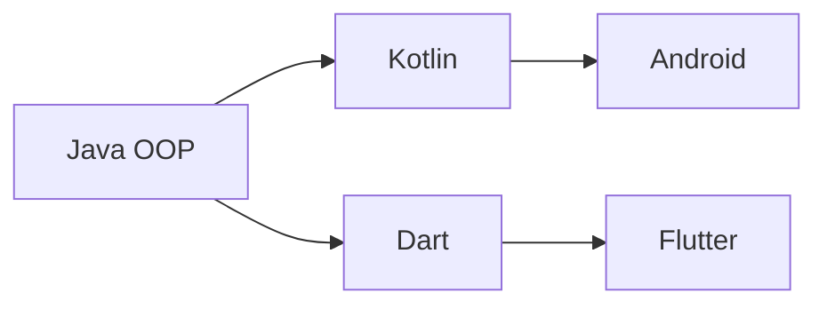

# Module 1 — Java Foundations

Welcome to the foundation of everything that follows. We'll learn programming using **Java** because:

1. It's strict — it forces you to think about types, structure, and OOP, which makes Kotlin (Module 2) and Android (Module 3) much easier later.
2. The Android platform was originally Java, so countless tutorials, libraries, and Stack Overflow answers are still in Java.
3. Once you "get" Java, picking up Dart (for Flutter) takes hours, not weeks.

## What's in this module

| # | Lesson | What you'll learn |
|---|---|---|
| 01 | [Introduction](01-introduction.md) | What programming is, how Java fits in |
| 02 | [Output & Hello World](02-output.md) | Your first program |
| 03 | [Comments](03-comments.md) | Three ways to write comments |
| 04 | [Naming](04-naming.md) | Variable naming rules and conventions |
| 05 | [Data Types](05-data-types.md) | int, double, char, boolean, String |
| 06 | [Operators](06-operators.md) | Arithmetic, assignment, comparison |
| 07 | [Conditionals](07-conditionals.md) | if / else / switch / ternary |
| 08 | [Loops](08-loops.md) | for, while, do-while, nested |
| 09 | [Arrays](09-arrays.md) | Single & multi-dimensional arrays |
| 10 | [Strings](10-strings.md) | String methods and manipulation |
| 11 | [Methods](11-methods.md) | Defining and calling functions |
| 12 | [OOP — Classes & Objects](12-oop-classes.md) | The mental model behind everything |
| 13 | [OOP — Inheritance](13-oop-inheritance.md) | Reusing behavior |
| 14 | [OOP — Polymorphism](14-oop-polymorphism.md) | One interface, many forms |
| 15 | [OOP — Abstraction](15-oop-abstraction.md) | Hiding complexity |
| 16 | [Encapsulation](16-encapsulation.md) | Access modifiers, getters/setters |
| 17 | [Collections](17-collections.md) | ArrayList, HashMap, HashSet |
| 18 | [Exceptions](18-exceptions.md) | try / catch / throw |

Then practice everything in **[Labs](labs.md)**.

## Prerequisites

- JDK 21+ installed (see [Getting Started](../getting-started.md))
- VS Code with the *Extension Pack for Java*
- About 30 hours of study time

## How OOP fits into mobile dev

Every mobile framework — Android, Flutter, iOS, React Native — is built on object-oriented thinking. **Master OOP here and the rest is detail.**

[Begin lesson 1 →](01-introduction.md){ .md-button .md-button--primary }
