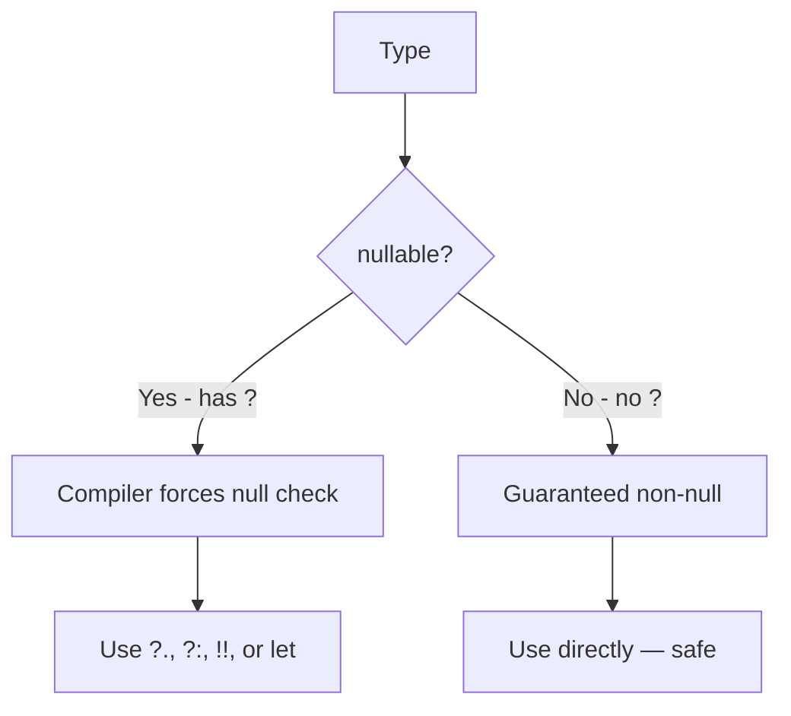

# Null Safety

Kotlin's most loved feature. The compiler **prevents NullPointerExceptions at compile time** by distinguishing nullable from non-nullable types.

## The Java pain

```java
String s = null;
s.length();   // NullPointerException at runtime — your app crashes
```

Tony Hoare called null "[the billion-dollar mistake](https://en.wikipedia.org/wiki/Tony_Hoare#Apologies_and_retractions)" — and any Android developer with scars from `NullPointerException` will agree.

## The Kotlin fix

```kotlin
var name: String = "Mazen"
name = null   // COMPILE ERROR — String is non-nullable

var nickname: String? = "Maz"   // The ? makes it nullable
nickname = null   // OK
```

The `?` after the type means "this can be null." Without `?`, the type is **non-null guaranteed**.

## Calling methods on nullable

The compiler forces you to handle the null case:

```kotlin
var nickname: String? = "Maz"
nickname.length    // COMPILE ERROR — could be null!

// Three safe approaches:
```

### 1. Safe call `?.`

```kotlin
val len = nickname?.length   // returns null if nickname is null
```

Chains: `user?.profile?.address?.city` — returns null if **any** link is null.

### 2. Elvis operator `?:`

```kotlin
val len = nickname?.length ?: 0
// "If left side is null, use the right side"
```

### 3. Not-null assertion `!!` (use sparingly)

```kotlin
val len = nickname!!.length
// "I swear this isn't null — throw NPE if I'm wrong"
```

If you find yourself using `!!` a lot, your design probably has a problem.

## Smart casts

After a null check, the compiler **knows** the variable is non-null in that branch:

```kotlin
var name: String? = "Mazen"

if (name != null) {
    println(name.length)   // OK — name is smart-cast to String
}
```

No cast needed — the compiler tracks the type narrowing automatically.

## Nullable collections

```kotlin
val list: List<String>?         // the list itself can be null
val list2: List<String?>        // list of nullable strings
val list3: List<String?>?       // both possible

list?.forEach { println(it) }
list2?.filterNotNull()?.forEach { println(it) }
```

## let — operate on non-null

```kotlin
val name: String? = "Mazen"

name?.let {
    println("Name is $it, length ${it.length}")
}
// Runs only if name != null. Inside, 'it' is non-null.
```

Idiomatic for "do something with this value if it exists."

## requireNotNull and check

For runtime validation:

```kotlin
fun process(input: String?) {
    val cleaned = requireNotNull(input) { "Input must not be null" }
    // cleaned is non-null from here on
}
```

## Platform types (when calling Java)

When you call Java code from Kotlin, the compiler doesn't know if it can return null. Such types show as `String!` in errors — they're "platform types."

```kotlin
val s: String = someJavaApi.getValue()
// You assume non-null. If Java returns null at runtime, you'll get NPE.
```

Always check Java APIs' nullability and add `?` if you're unsure.

## The mental model



## Try it yourself

Refactor this Java to Kotlin with proper null safety:

```java
public String greet(String name) {
    if (name == null) return "Hello, stranger";
    return "Hello, " + name.toUpperCase();
}
```

??? success "Solution"
    ```kotlin
    fun greet(name: String?): String {
        return "Hello, ${name?.uppercase() ?: "stranger"}"
    }

    // or, more explicit:
    fun greet2(name: String?): String =
        if (name == null) "Hello, stranger"
        else "Hello, ${name.uppercase()}"
    ```

[← Previous](02-variables-types.md){ .md-button } [Next: Functions →](04-functions.md){ .md-button }
