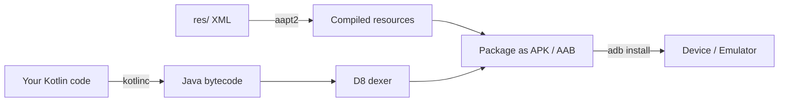

# Anatomy of an Android App

Open the project Android Studio created. Here's what every file means and why it's there.

## Top-level structure

```
HelloAndroid/
├── app/                       # your app module
│   ├── build.gradle.kts       # app-specific build config
│   ├── src/main/
│   │   ├── AndroidManifest.xml
│   │   ├── java/com/.../      # Kotlin code
│   │   └── res/               # resources (layouts, images, strings)
├── build.gradle.kts           # project-level build config
├── gradle.properties
└── settings.gradle.kts
```

## AndroidManifest.xml — the app's identity card

Every Android app has one manifest. It tells the OS:

- App package name (unique identifier)
- Which activities/services/receivers exist
- What permissions the app needs
- Which activity is the "launcher" (opens when you tap the icon)
- Target SDK, hardware requirements, etc.

```xml
<?xml version="1.0" encoding="utf-8"?>
<manifest xmlns:android="http://schemas.android.com/apk/res/android">

    <application
        android:allowBackup="true"
        android:icon="@mipmap/ic_launcher"
        android:label="@string/app_name"
        android:theme="@style/Theme.HelloAndroid">

        <activity
            android:name=".MainActivity"
            android:exported="true">

            <intent-filter>
                <action android:name="android.intent.action.MAIN" />
                <category android:name="android.intent.category.LAUNCHER" />
            </intent-filter>

        </activity>
    </application>

</manifest>
```

The `<intent-filter>` with `MAIN` + `LAUNCHER` is what makes this activity the home screen entry point.

### Permissions

```xml
<uses-permission android:name="android.permission.INTERNET" />
<uses-permission android:name="android.permission.CAMERA" />
```

Some permissions are auto-granted (`INTERNET`). Dangerous permissions (`CAMERA`, `LOCATION`) require runtime request — covered in Module 3 lesson 12.

## Activities

An **Activity** is one screen. A simple app might have one activity; a complex one might have dozens.

Each activity is a Kotlin class that extends `AppCompatActivity`:

```kotlin
class MainActivity : AppCompatActivity() {
    override fun onCreate(savedInstanceState: Bundle?) {
        super.onCreate(savedInstanceState)
        setContentView(R.layout.activity_main)
    }
}
```

`setContentView(R.layout.activity_main)` tells Android: "use the XML file at `res/layout/activity_main.xml` to draw this screen."

We'll dive into Activities in the next lesson.

## res/ — resources

Anything visual that's not code lives here, organized by type:

| Folder | Contains |
|---|---|
| `res/layout/` | XML layout files for activities/fragments |
| `res/values/strings.xml` | All user-facing text |
| `res/values/colors.xml` | Named colors (`<color name="primary">#3F51B5</color>`) |
| `res/values/themes.xml` | Material themes for your app |
| `res/drawable/` | Icons, shapes, gradients (PNG, SVG, or XML) |
| `res/mipmap/` | Launcher icons (different sizes for different densities) |
| `res/raw/` | Raw assets (videos, audio) |

### Why externalize strings?

```xml
<!-- strings.xml -->
<resources>
    <string name="app_name">Hello Android</string>
    <string name="welcome">Welcome to the app</string>
</resources>
```

Then in XML: `android:text="@string/welcome"`. In Kotlin: `getString(R.string.welcome)`.

Why bother?
- **Translation** — drop a `values-ar/strings.xml` with Arabic and your app auto-localizes
- **Single source of truth** — change a word once, it updates everywhere
- **Code review** — a copy change is one line in one file

## R — the generated index

```kotlin
setContentView(R.layout.activity_main)
findViewById(R.id.button_submit)
getString(R.string.welcome)
```

`R` is a class Android Studio generates from your `res/` folder. Every resource gets an integer ID. The build system regenerates `R` whenever resources change.

## Gradle — the build system

Two `build.gradle.kts` files:

### Project-level (`/build.gradle.kts`)

Configures Gradle itself, plugin versions, repositories.

### App-level (`/app/build.gradle.kts`)

The important one — your app's actual config:

```kotlin
android {
    namespace = "com.example.helloandroid"
    compileSdk = 34

    defaultConfig {
        applicationId = "com.example.helloandroid"
        minSdk = 24
        targetSdk = 34
        versionCode = 1
        versionName = "1.0"
    }
    // ...
}

dependencies {
    implementation("androidx.core:core-ktx:1.12.0")
    implementation("androidx.appcompat:appcompat:1.6.1")
    implementation("com.google.android.material:material:1.11.0")
    // add libraries here
}
```

When you add `implementation("io.coil-kt:coil:2.5.0")` and sync Gradle, the library is downloaded and available for import. This is how you add Retrofit, Glide, Room, etc.

## Build & run flow



You don't need to know the details — Android Studio handles it. Just know that when you click ▶, this whole pipeline runs.

## Try it yourself

1. Open `res/values/strings.xml`. Add a new string: `<string name="footer">Built with Kotlin</string>`
2. Open `res/layout/activity_main.xml`. Add a second `TextView` that uses `android:text="@string/footer"`
3. Re-run. You should see two text elements.

[← Previous](01-android-studio-setup.md){ .md-button } [Next: Activity Lifecycle →](03-activity-lifecycle.md){ .md-button }
