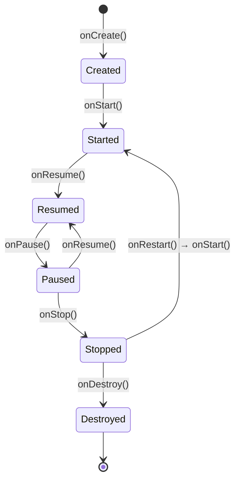

# Activity Lifecycle

The lifecycle is the single most important Android concept. Every interview asks about it. Get this right and ~half of common Android bugs disappear.

## The diagram



## The seven callbacks

| Method | When it runs | What to do |
|---|---|---|
| `onCreate()` | Once when the activity is born | Inflate UI, initialize fields, restore state |
| `onStart()` | Becomes visible (but not foreground) | Subscribe to data, register receivers |
| `onResume()` | User can interact | Start camera/animations, resume video |
| `onPause()` | Loses focus (dialog, partial overlay) | Stop animations, save volatile state |
| `onStop()` | Fully hidden | Unsubscribe, release heavy resources |
| `onRestart()` | Coming back from stopped | Re-prepare resources |
| `onDestroy()` | Activity is being killed | Final cleanup |

## Real example

```kotlin
class MainActivity : AppCompatActivity() {
    override fun onCreate(savedInstanceState: Bundle?) {
        super.onCreate(savedInstanceState)
        setContentView(R.layout.activity_main)
        Log.d("LIFE", "onCreate")
    }

    override fun onStart() {
        super.onStart()
        Log.d("LIFE", "onStart")
    }

    override fun onResume() {
        super.onResume()
        Log.d("LIFE", "onResume")
    }

    override fun onPause() {
        super.onPause()
        Log.d("LIFE", "onPause")
    }

    override fun onStop() {
        super.onStop()
        Log.d("LIFE", "onStop")
    }

    override fun onDestroy() {
        super.onDestroy()
        Log.d("LIFE", "onDestroy")
    }
}
```

Run it, watch Logcat (filter to `LIFE`), and observe:

| Action | Callbacks |
|---|---|
| Launch app | onCreate → onStart → onResume |
| Press Home | onPause → onStop |
| Return to app | onRestart → onStart → onResume |
| Press Back | onPause → onStop → onDestroy |
| Rotate device | onPause → onStop → onDestroy → onCreate → onStart → onResume |
| Receive a phone call | onPause (call) → onResume (back to app) |

## Why rotation destroys the activity

When the device rotates, Android destroys and recreates the activity with the new orientation's resources. **Your local variables are wiped.** This is the #1 source of "but it worked before I rotated" bugs.

Solutions:

- For UI state: use `onSaveInstanceState` (covered below)
- For data: use `ViewModel` (covered in lesson 9 — the modern answer)

## onSaveInstanceState

For tiny pieces of UI state:

```kotlin
override fun onSaveInstanceState(outState: Bundle) {
    super.onSaveInstanceState(outState)
    outState.putString("user_input", findViewById<EditText>(R.id.input).text.toString())
}

override fun onCreate(savedInstanceState: Bundle?) {
    super.onCreate(savedInstanceState)
    setContentView(R.layout.activity_main)
    savedInstanceState?.getString("user_input")?.let {
        findViewById<EditText>(R.id.input).setText(it)
    }
}
```

Use this for UI-only state (current tab, scroll position, open dialog state). For real data, use `ViewModel`.

## Lifecycle-aware components

Modern Android has classes that **observe the lifecycle** for you, so you don't have to call `start`/`stop` from every callback. Examples:

- `ViewModel` — survives rotation automatically
- `LifecycleObserver` — your custom classes can hook into lifecycle events
- `LiveData` / `StateFlow` — auto-unsubscribe when the lifecycle is stopped

You'll use these heavily in lesson 9.

## Common pitfalls

!!! danger "Memory leaks"
    Holding a reference to the activity in something that outlives it (a singleton, a static field, a long-running callback) prevents garbage collection. The whole activity (and its views) stays in memory. Always use `WeakReference` or release in `onDestroy`.

!!! danger "Doing heavy work in onCreate"
    Loading data from the network in `onCreate` blocks the UI. Use a coroutine + `lifecycleScope` for async work.

!!! danger "Forgetting to call super"
    Every callback must start with `super.onCreate(...)` etc. Forgetting throws `SuperNotCalledException`.

## Try it yourself

1. Add lifecycle logs (as above) to your `MainActivity`
2. Run, observe one full cycle
3. Press Home, return — note the partial cycle
4. Rotate the device (Ctrl+F11 in emulator) — note the destroy/recreate
5. Try to make a counter (`var clicks = 0` in the Activity, incremented by a button). Notice that **rotation resets it**. We'll fix this in lesson 9.

[← Previous](02-anatomy.md){ .md-button } [Next: Layouts & Views →](04-layouts-views.md){ .md-button }
