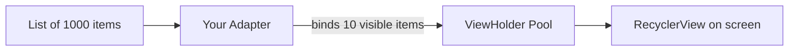

# RecyclerView

Any app shows lists — chat messages, products, contacts, feed posts. `RecyclerView` is Android's efficient, infinitely-scrollable list widget. It's worth the upfront complexity because **every real app uses it**.

## The mental model

`RecyclerView` recycles a small pool of views. If your list has 1,000 items but only 8 fit on screen, RecyclerView keeps ~10 view objects in memory and rebinds them as you scroll. **Memory stays constant**, no matter how long the list is.



## Four pieces

| Piece | What it does |
|---|---|
| **Data** | A `List<T>` of your items |
| **ViewHolder** | Holds references to the views in one row |
| **Adapter** | Creates ViewHolders, binds data to them |
| **LayoutManager** | Decides how rows are arranged (linear, grid, etc.) |

## Setup — step by step

### 1. Add to your layout

```xml
<androidx.recyclerview.widget.RecyclerView
    android:id="@+id/recycler"
    android:layout_width="match_parent"
    android:layout_height="match_parent" />
```

### 2. Design one row's layout

```xml title="res/layout/item_user.xml"
<LinearLayout
    xmlns:android="http://schemas.android.com/apk/res/android"
    android:layout_width="match_parent"
    android:layout_height="wrap_content"
    android:orientation="vertical"
    android:padding="16dp">

    <TextView
        android:id="@+id/name"
        android:layout_width="match_parent"
        android:layout_height="wrap_content"
        android:textSize="18sp"
        android:textStyle="bold" />

    <TextView
        android:id="@+id/email"
        android:layout_width="match_parent"
        android:layout_height="wrap_content"
        android:textColor="#888" />
</LinearLayout>
```

### 3. Data class

```kotlin
data class User(val id: Int, val name: String, val email: String)
```

### 4. The Adapter

```kotlin
class UserAdapter(
    private val users: List<User>,
    private val onClick: (User) -> Unit
) : RecyclerView.Adapter<UserAdapter.ViewHolder>() {

    inner class ViewHolder(view: View) : RecyclerView.ViewHolder(view) {
        val name: TextView = view.findViewById(R.id.name)
        val email: TextView = view.findViewById(R.id.email)
    }

    override fun onCreateViewHolder(parent: ViewGroup, viewType: Int): ViewHolder {
        val view = LayoutInflater.from(parent.context)
            .inflate(R.layout.item_user, parent, false)
        return ViewHolder(view)
    }

    override fun onBindViewHolder(holder: ViewHolder, position: Int) {
        val user = users[position]
        holder.name.text = user.name
        holder.email.text = user.email
        holder.itemView.setOnClickListener { onClick(user) }
    }

    override fun getItemCount() = users.size
}
```

### 5. Wire it up

```kotlin
class UserListActivity : AppCompatActivity() {
    override fun onCreate(savedInstanceState: Bundle?) {
        super.onCreate(savedInstanceState)
        setContentView(R.layout.activity_user_list)

        val users = listOf(
            User(1, "Mazen", "mazen@example.com"),
            User(2, "Sara", "sara@example.com"),
            User(3, "Ahmed", "ahmed@example.com")
        )

        val recycler = findViewById<RecyclerView>(R.id.recycler)
        recycler.layoutManager = LinearLayoutManager(this)
        recycler.adapter = UserAdapter(users) { user ->
            Toast.makeText(this, "Tapped ${user.name}", Toast.LENGTH_SHORT).show()
        }
    }
}
```

## Different LayoutManagers

| Manager | Arrangement |
|---|---|
| `LinearLayoutManager(ctx)` | Vertical scrolling list (default) |
| `LinearLayoutManager(ctx, HORIZONTAL, false)` | Horizontal scroll |
| `GridLayoutManager(ctx, 2)` | 2-column grid |
| `StaggeredGridLayoutManager(2, VERTICAL)` | Pinterest-style staggered grid |

## Updating data

Don't directly modify the list and hope. Use the adapter's notify methods:

```kotlin
class UserAdapter(...) : ... {
    private val items = users.toMutableList()

    fun addItem(user: User) {
        items.add(user)
        notifyItemInserted(items.size - 1)
    }

    fun removeAt(position: Int) {
        items.removeAt(position)
        notifyItemRemoved(position)
    }

    fun updateAll(newUsers: List<User>) {
        items.clear()
        items.addAll(newUsers)
        notifyDataSetChanged()  // less efficient but simple
    }
}
```

For diffing (only update what actually changed), use **`ListAdapter` + `DiffUtil`** — covered in advanced courses, but worth Googling.

## ViewBinding for clean code

Instead of `findViewById` everywhere, enable View Binding (lesson 13) and your ViewHolder becomes:

```kotlin
inner class ViewHolder(val binding: ItemUserBinding) : RecyclerView.ViewHolder(binding.root)

override fun onCreateViewHolder(parent: ViewGroup, viewType: Int) =
    ViewHolder(ItemUserBinding.inflate(LayoutInflater.from(parent.context), parent, false))

override fun onBindViewHolder(holder: ViewHolder, position: Int) {
    holder.binding.name.text = users[position].name
    holder.binding.email.text = users[position].email
}
```

## Try it yourself

Build a list of 20 movies. Each row shows the title, year, and rating (out of 10). Tapping a movie shows a Toast with the rating.

Bonus: add a `FloatingActionButton` that adds a new movie to the top of the list.

??? success "Solution sketch"
    ```kotlin
    data class Movie(val title: String, val year: Int, val rating: Double)

    class MovieAdapter(private val movies: MutableList<Movie>, val onClick: (Movie) -> Unit)
        : RecyclerView.Adapter<MovieAdapter.VH>() {

        inner class VH(v: View) : RecyclerView.ViewHolder(v) {
            val title: TextView = v.findViewById(R.id.title)
            val sub: TextView = v.findViewById(R.id.sub)
        }

        override fun onCreateViewHolder(p: ViewGroup, t: Int) = VH(
            LayoutInflater.from(p.context).inflate(R.layout.item_movie, p, false)
        )

        override fun onBindViewHolder(h: VH, pos: Int) {
            val m = movies[pos]
            h.title.text = m.title
            h.sub.text = "${m.year} — ${m.rating}/10"
            h.itemView.setOnClickListener { onClick(m) }
        }

        override fun getItemCount() = movies.size

        fun prepend(m: Movie) {
            movies.add(0, m)
            notifyItemInserted(0)
        }
    }
    ```

[← Previous](05-intents.md){ .md-button } [Next: Fragments →](07-fragments.md){ .md-button }
