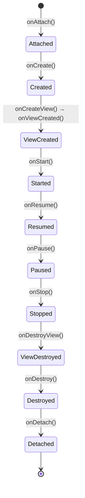

# Fragments

A **Fragment** is a reusable, self-contained UI piece that lives inside an Activity. Think of them as "mini-activities."

## When and why

- **Tablet vs phone UIs** — show two fragments side-by-side on tablet, one at a time on phone
- **Navigation Component** — modern app architecture is "one Activity, many Fragments"
- **Bottom tabs / Drawer** — each tab is typically a Fragment
- **ViewPager** — swipeable screens are usually Fragments

## Simple fragment

```kotlin title="HomeFragment.kt"
class HomeFragment : Fragment() {

    override fun onCreateView(
        inflater: LayoutInflater,
        container: ViewGroup?,
        savedInstanceState: Bundle?
    ): View {
        return inflater.inflate(R.layout.fragment_home, container, false)
    }

    override fun onViewCreated(view: View, savedInstanceState: Bundle?) {
        super.onViewCreated(view, savedInstanceState)
        view.findViewById<TextView>(R.id.title).text = "Welcome home"
    }
}
```

```xml title="res/layout/fragment_home.xml"
<LinearLayout xmlns:android="http://schemas.android.com/apk/res/android"
    android:layout_width="match_parent"
    android:layout_height="match_parent"
    android:padding="24dp">

    <TextView
        android:id="@+id/title"
        android:layout_width="match_parent"
        android:layout_height="wrap_content"
        android:textSize="20sp" />
</LinearLayout>
```

## Adding a fragment to an Activity

Two ways: declaratively in XML, or programmatically with a `FragmentTransaction`.

### Declarative

```xml title="activity_main.xml"
<FrameLayout
    android:id="@+id/fragment_container"
    android:layout_width="match_parent"
    android:layout_height="match_parent"/>
```

```kotlin
class MainActivity : AppCompatActivity() {
    override fun onCreate(savedInstanceState: Bundle?) {
        super.onCreate(savedInstanceState)
        setContentView(R.layout.activity_main)

        if (savedInstanceState == null) {
            supportFragmentManager.commit {
                replace(R.id.fragment_container, HomeFragment())
            }
        }
    }
}
```

The `savedInstanceState == null` check prevents adding the fragment a second time on rotation (the system restores it automatically).

## Fragment lifecycle

Similar to Activity but more callbacks (because Fragments can be detached/re-attached):



## Passing arguments — the safe way

Don't use a constructor with parameters. Use the `arguments` Bundle:

```kotlin
class DetailFragment : Fragment() {
    companion object {
        private const val ARG_USER_ID = "user_id"

        fun newInstance(userId: Int) = DetailFragment().apply {
            arguments = Bundle().apply { putInt(ARG_USER_ID, userId) }
        }
    }

    private var userId: Int = -1

    override fun onCreate(savedInstanceState: Bundle?) {
        super.onCreate(savedInstanceState)
        userId = arguments?.getInt(ARG_USER_ID, -1) ?: -1
    }
}

// caller:
supportFragmentManager.commit {
    replace(R.id.container, DetailFragment.newInstance(42))
}
```

Why? When Android destroys and recreates your fragment (rotation, low memory), it calls the no-arg constructor and re-supplies `arguments`. Pass values any other way → they're lost.

## Communicating with the parent activity

Use a **FragmentResultListener** (modern) or shared **ViewModel** (covered in lesson 9):

```kotlin
// In the fragment that produces a result:
parentFragmentManager.setFragmentResult("user_picked", bundleOf("id" to 42))

// In the Activity or another Fragment:
supportFragmentManager.setFragmentResultListener("user_picked", this) { _, bundle ->
    val id = bundle.getInt("id")
    // ...
}
```

## Adding multiple fragments

```kotlin
supportFragmentManager.commit {
    add(R.id.left_pane, ListFragment())
    add(R.id.right_pane, DetailFragment())
}
```

`add` vs `replace`:

- `add` — adds on top; the previous fragment stays in memory
- `replace` — destroys the previous fragment's view, swaps in the new one

## Back stack

```kotlin
supportFragmentManager.commit {
    replace(R.id.container, DetailFragment())
    addToBackStack(null)
}
```

`addToBackStack` makes the back button pop this transaction.

## ViewBinding for fragments

In `build.gradle.kts`:

```kotlin
android {
    buildFeatures { viewBinding = true }
}
```

In the fragment:

```kotlin
class HomeFragment : Fragment() {
    private var _binding: FragmentHomeBinding? = null
    private val binding get() = _binding!!

    override fun onCreateView(
        inflater: LayoutInflater,
        container: ViewGroup?,
        savedInstanceState: Bundle?
    ): View {
        _binding = FragmentHomeBinding.inflate(inflater, container, false)
        return binding.root
    }

    override fun onViewCreated(view: View, savedInstanceState: Bundle?) {
        binding.title.text = "Hello"
    }

    override fun onDestroyView() {
        super.onDestroyView()
        _binding = null   // avoid memory leaks
    }
}
```

The `_binding`/`binding` pattern is the standard for Fragment + ViewBinding.

## Try it yourself

1. Create an Activity with two Fragments stacked vertically — `HeaderFragment` (shows a title) and `ContentFragment` (shows a button)
2. When the button in `ContentFragment` is tapped, change the title in `HeaderFragment` (use `setFragmentResultListener`)

[← Previous](06-recyclerview.md){ .md-button } [Next: Navigation Component →](08-navigation-component.md){ .md-button }
