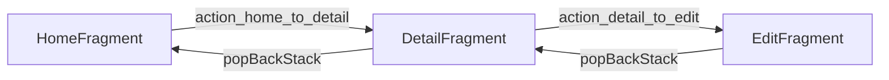

# Navigation Component

Google's official navigation library. Defines all routes between fragments in a single visual graph and handles back-stack, deep links, and type-safe arguments.

## Why use it

Without it:
- `FragmentTransaction` boilerplate everywhere
- Back button handling is fragile
- Passing arguments isn't type-safe
- Deep links are a nightmare

With it: one XML file, declarative routes, generated code for type-safe args.

## Setup

In `build.gradle.kts`:

```kotlin
dependencies {
    val nav = "2.7.7"
    implementation("androidx.navigation:navigation-fragment-ktx:$nav")
    implementation("androidx.navigation:navigation-ui-ktx:$nav")
}
```

For type-safe arguments (Safe Args plugin):

```kotlin
// project-level
plugins {
    id("androidx.navigation.safeargs.kotlin") version "2.7.7" apply false
}

// app-level
plugins {
    id("androidx.navigation.safeargs.kotlin")
}
```

## Navigation graph

Create `res/navigation/nav_graph.xml`:

```xml
<?xml version="1.0" encoding="utf-8"?>
<navigation xmlns:android="http://schemas.android.com/apk/res/android"
    xmlns:app="http://schemas.android.com/apk/res-auto"
    android:id="@+id/nav_graph"
    app:startDestination="@id/homeFragment">

    <fragment
        android:id="@+id/homeFragment"
        android:name="com.example.app.HomeFragment"
        android:label="Home">

        <action
            android:id="@+id/action_home_to_detail"
            app:destination="@id/detailFragment" />
    </fragment>

    <fragment
        android:id="@+id/detailFragment"
        android:name="com.example.app.DetailFragment"
        android:label="Detail">

        <argument
            android:name="userId"
            app:argType="integer" />

        <action
            android:id="@+id/action_detail_to_edit"
            app:destination="@id/editFragment" />
    </fragment>

    <fragment
        android:id="@+id/editFragment"
        android:name="com.example.app.EditFragment"
        android:label="Edit" />

</navigation>
```

Each `<fragment>` is a destination. Each `<action>` is a navigation route. Each `<argument>` defines required data.

## Wire to your Activity

```xml title="activity_main.xml"
<androidx.fragment.app.FragmentContainerView
    android:id="@+id/nav_host"
    android:name="androidx.navigation.fragment.NavHostFragment"
    android:layout_width="match_parent"
    android:layout_height="match_parent"
    app:defaultNavHost="true"
    app:navGraph="@navigation/nav_graph" />
```

That's it. Android shows the start destination automatically.

## Navigating

```kotlin
// In HomeFragment
findNavController().navigate(R.id.action_home_to_detail)
```

With Safe Args (type-safe):

```kotlin
val action = HomeFragmentDirections.actionHomeToDetail(userId = 42)
findNavController().navigate(action)
```

The plugin generates `HomeFragmentDirections` from your nav_graph. **Compile-time-checked arguments** — no string keys, no casting.

## Receiving arguments

```kotlin
class DetailFragment : Fragment() {
    private val args: DetailFragmentArgs by navArgs()

    override fun onViewCreated(view: View, savedInstanceState: Bundle?) {
        super.onViewCreated(view, savedInstanceState)
        val userId = args.userId   // type-safe Int
        // ...
    }
}
```

## Back stack

The Navigation Component manages it automatically. The user pressing Back pops to the previous destination.

To navigate up (act like Back) programmatically:

```kotlin
findNavController().navigateUp()
```

To pop to a specific destination:

```kotlin
findNavController().popBackStack(R.id.homeFragment, false)
```

## Visual graph editor

Android Studio has a visual editor for nav graphs — drag fragments, draw arrows between them. The XML is generated/updated automatically. Find it by opening `nav_graph.xml` and switching to the "Design" tab.

## Bottom navigation integration

```xml title="res/menu/bottom_nav.xml"
<menu xmlns:android="http://schemas.android.com/apk/res/android">
    <item android:id="@+id/homeFragment"
        android:title="Home"
        android:icon="@drawable/ic_home" />
    <item android:id="@+id/profileFragment"
        android:title="Profile"
        android:icon="@drawable/ic_person" />
</menu>
```

```kotlin
// In MainActivity
val navHost = supportFragmentManager.findFragmentById(R.id.nav_host) as NavHostFragment
val navController = navHost.navController
findViewById<BottomNavigationView>(R.id.bottom_nav).setupWithNavController(navController)
```

The IDs in the menu must match destination IDs in the nav graph. Tapping a tab navigates automatically.

## Deep links

In nav_graph:

```xml
<fragment android:id="@+id/profileFragment" ...>
    <deepLink app:uri="myapp://profile/{userId}" />
</fragment>
```

Now `myapp://profile/42` opens that fragment with `userId=42` — works from a notification, browser link, or another app.

## Diagram



## Try it yourself

1. Set up a 3-fragment app: `ListFragment`, `DetailFragment`, `EditFragment`
2. `ListFragment` shows a list; tapping an item navigates to `DetailFragment` with the ID
3. `DetailFragment` has an "Edit" button that navigates to `EditFragment`
4. Pressing Back from anywhere returns through the chain to `ListFragment`

[← Previous](07-fragments.md){ .md-button } [Next: ViewModel & LiveData →](09-viewmodel-livedata.md){ .md-button }
