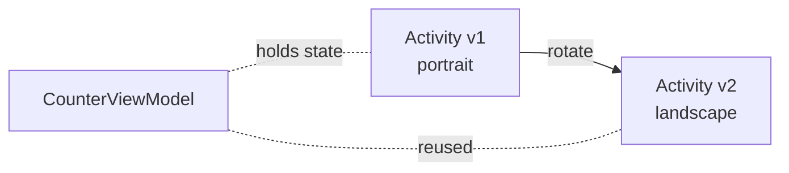

# ViewModel & LiveData

Remember the rotation problem from lesson 3? **`ViewModel` solves it.** It outlives the Activity/Fragment that owns it, so state survives configuration changes.

## The problem

```kotlin
class MainActivity : AppCompatActivity() {
    var counter = 0   // resets to 0 on rotation
}
```

## The solution

```kotlin
class CounterViewModel : ViewModel() {
    var counter = 0

    fun increment() { counter++ }
}

class MainActivity : AppCompatActivity() {
    private val vm: CounterViewModel by viewModels()

    override fun onCreate(savedInstanceState: Bundle?) {
        super.onCreate(savedInstanceState)
        setContentView(R.layout.activity_main)

        findViewById<Button>(R.id.btn).setOnClickListener {
            vm.increment()
            findViewById<TextView>(R.id.label).text = vm.counter.toString()
        }
    }
}
```

Rotate the device — the counter persists. Magic.

## Setup

```kotlin
dependencies {
    implementation("androidx.lifecycle:lifecycle-viewmodel-ktx:2.7.0")
    implementation("androidx.lifecycle:lifecycle-livedata-ktx:2.7.0")
    implementation("androidx.activity:activity-ktx:1.8.2")
    implementation("androidx.fragment:fragment-ktx:1.6.2")
}
```

## Why this works

The system associates the ViewModel with the Activity's *survival scope* — destroyed only when the activity is finally finished for good (back-press to root, or system-killed). Rotation does **not** finish it.



## LiveData — observable state

Direct field access (`vm.counter`) means the UI doesn't auto-update when state changes. **LiveData** makes data observable:

```kotlin
class CounterViewModel : ViewModel() {
    private val _count = MutableLiveData(0)
    val count: LiveData<Int> = _count

    fun increment() {
        _count.value = (_count.value ?: 0) + 1
    }
}

class MainActivity : AppCompatActivity() {
    private val vm: CounterViewModel by viewModels()

    override fun onCreate(savedInstanceState: Bundle?) {
        super.onCreate(savedInstanceState)
        setContentView(R.layout.activity_main)

        val label = findViewById<TextView>(R.id.label)

        vm.count.observe(this) { value ->
            label.text = value.toString()
        }

        findViewById<Button>(R.id.btn).setOnClickListener { vm.increment() }
    }
}
```

`observe(this)` ties the observer to the activity's lifecycle — auto-unsubscribes when stopped.

### Why two LiveData fields?

```kotlin
private val _count = MutableLiveData(0)   // internal, mutable
val count: LiveData<Int> = _count          // public, read-only
```

The UI can't directly set `count` — only the ViewModel can. This enforces unidirectional data flow:

```
UI event → ViewModel method → _count.value = ... → LiveData notifies UI → UI updates
```

## StateFlow — the modern replacement

LiveData is being gradually replaced by **`StateFlow`** (a Kotlin coroutines primitive). For new code, prefer StateFlow:

```kotlin
class CounterViewModel : ViewModel() {
    private val _count = MutableStateFlow(0)
    val count: StateFlow<Int> = _count.asStateFlow()

    fun increment() {
        _count.value = _count.value + 1
    }
}

// in Activity:
lifecycleScope.launch {
    repeatOnLifecycle(Lifecycle.State.STARTED) {
        vm.count.collect { value ->
            label.text = value.toString()
        }
    }
}
```

`StateFlow` integrates better with Jetpack Compose and Kotlin coroutines. We use both in this course because legacy code is full of LiveData.

## Loading data — viewModelScope

`ViewModel` has its own coroutine scope that's cancelled when the ViewModel dies:

```kotlin
class UserViewModel : ViewModel() {
    private val _user = MutableStateFlow<User?>(null)
    val user: StateFlow<User?> = _user.asStateFlow()

    fun loadUser(id: Int) {
        viewModelScope.launch {
            val u = repository.fetchUser(id)
            _user.value = u
        }
    }
}
```

If the user rotates the device mid-fetch, the coroutine **continues** (the ViewModel survives). When the new activity attaches, it observes the result.

## ViewModel for sharing data between Fragments

When two Fragments in the same Activity need to share data, give them a ViewModel scoped to the **activity**:

```kotlin
class FragmentA : Fragment() {
    private val sharedVm: SharedViewModel by activityViewModels()
}

class FragmentB : Fragment() {
    private val sharedVm: SharedViewModel by activityViewModels()
}
```

Both fragments now see the same ViewModel instance. Updates from A are observed by B automatically.

## Common mistakes

!!! danger "Holding Activity reference in ViewModel"
    Never store a `Context`, `View`, or `Activity` in a ViewModel — it survives the activity's death and would leak the old one. If you need a Context, use `AndroidViewModel(application)` which gives you the `Application` context (safe).

!!! warning "Initial value"
    `LiveData<Int>` starts as `null`. Use `MutableLiveData(0)` or guard with `?: 0` in observers.

## Try it yourself

Build a "Todo" screen:

- `TodoViewModel` exposes `StateFlow<List<String>>` of todo items
- `addTodo(text: String)` appends to the list
- `removeTodo(index: Int)` removes one
- UI: an EditText + Add button, a RecyclerView showing items
- Verify it survives rotation

[← Previous](08-navigation-component.md){ .md-button } [Next: Room Database →](10-room-database.md){ .md-button }
