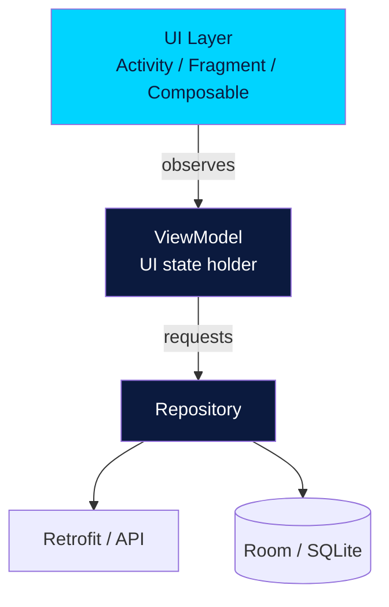

# Module 3 — Android Native

This is where it gets fun — you'll build real Android apps that install on real phones.

We cover **both** the classic XML/View system (still used in millions of production apps) and **Jetpack Compose** (Google's modern declarative UI toolkit). You need to know both — even greenfield apps end up integrating legacy fragments.

## What's in this module

| # | Lesson | What you'll learn |
|---|---|---|
| 01 | [Android Studio Setup](01-android-studio-setup.md) | Install, configure emulator, first project |
| 02 | [Anatomy of an Android App](02-anatomy.md) | Manifest, Activities, resources, Gradle |
| 03 | [Activity Lifecycle](03-activity-lifecycle.md) | The 7 callbacks every Android dev knows |
| 04 | [Layouts & Views (XML)](04-layouts-views.md) | LinearLayout, ConstraintLayout, FrameLayout |
| 05 | [Intents](05-intents.md) | Move between screens, share data |
| 06 | [RecyclerView](06-recyclerview.md) | Scrollable lists done right |
| 07 | [Fragments](07-fragments.md) | Reusable UI components |
| 08 | [Navigation Component](08-navigation-component.md) | Type-safe, graph-based navigation |
| 09 | [ViewModel & LiveData](09-viewmodel-livedata.md) | Survive rotation, observe state |
| 10 | [Room Database](10-room-database.md) | Local SQL persistence |
| 11 | [Retrofit Networking](11-retrofit-networking.md) | Type-safe REST clients |
| 12 | [Material Design](12-material-design.md) | Google's design system |
| 13 | [Jetpack Compose](13-jetpack-compose.md) | Declarative UI, the future |

Then practice in **[Labs](labs.md)**.

## Prerequisites

- Module 2 (Kotlin) — **required**
- Android Studio installed with an emulator OR a physical Android device
- 40-60 hours

## App architecture you'll learn

This is **MVVM with Repository pattern** — the architecture Google officially recommends. Every modern Android app you'll work on uses some variation of this.

[Begin lesson 1 →](01-android-studio-setup.md){ .md-button .md-button--primary }
