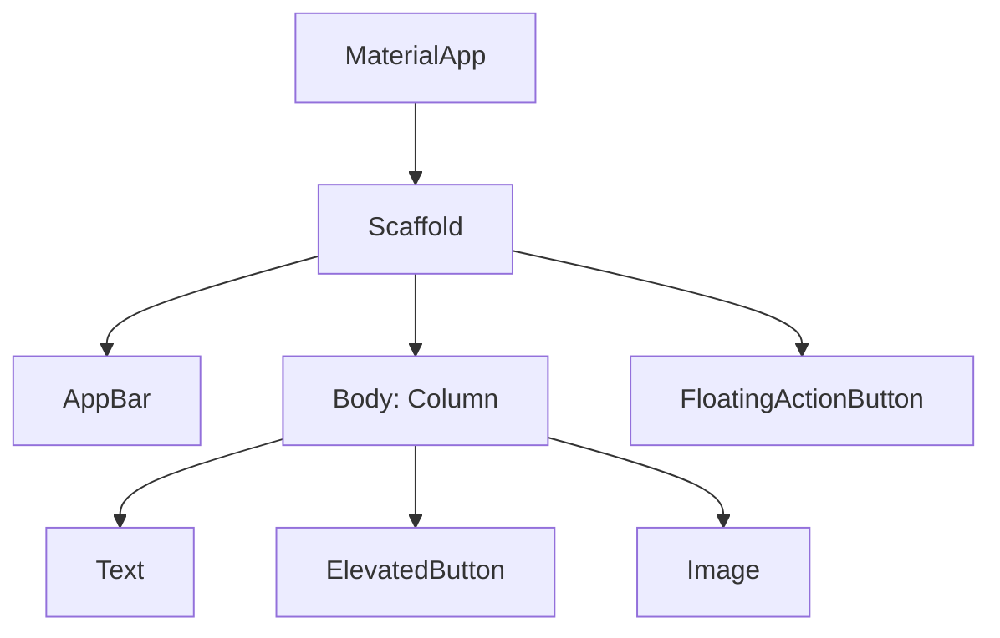

# Widgets Intro

In Flutter, **everything is a widget** — buttons, text, padding, layout, even your whole app. Widgets describe what the UI should look like; Flutter handles the rest.

## The mental model

A widget is a Dart class that returns a tree of more widgets. Eventually you reach widgets that draw something (like `Text` or `Image`).



Every UI on every screen is a tree like this.

## Hello widget

```dart
import 'package:flutter/material.dart';

void main() {
  runApp(const MyApp());
}

class MyApp extends StatelessWidget {
  const MyApp({super.key});

  @override
  Widget build(BuildContext context) {
    return MaterialApp(
      title: 'Hello Flutter',
      theme: ThemeData(
        colorScheme: ColorScheme.fromSeed(seedColor: Colors.blue),
        useMaterial3: true,
      ),
      home: const HomeScreen(),
    );
  }
}

class HomeScreen extends StatelessWidget {
  const HomeScreen({super.key});

  @override
  Widget build(BuildContext context) {
    return Scaffold(
      appBar: AppBar(title: const Text('Home')),
      body: const Center(
        child: Text('Hello, Flutter!'),
      ),
    );
  }
}
```

`runApp(MyApp())` is the equivalent of `setContentView`. `MaterialApp` wraps everything in Material Design defaults.

## StatelessWidget vs StatefulWidget

| | StatelessWidget | StatefulWidget |
|---|---|---|
| Stores state? | No | Yes |
| Rebuilds when? | When parent rebuilds | When `setState` is called |
| Use for | Pure UI based on inputs | UI that changes over time |

```dart
class Greeting extends StatelessWidget {
  final String name;
  const Greeting(this.name, {super.key});

  @override
  Widget build(BuildContext context) {
    return Text('Hello, $name');
  }
}
```

Stateful version (we'll cover state in lesson 5):

```dart
class Counter extends StatefulWidget {
  const Counter({super.key});

  @override
  State<Counter> createState() => _CounterState();
}

class _CounterState extends State<Counter> {
  int count = 0;

  void increment() => setState(() => count++);

  @override
  Widget build(BuildContext context) {
    return Column(
      children: [
        Text('Count: $count'),
        ElevatedButton(onPressed: increment, child: const Text('+1')),
      ],
    );
  }
}
```

## Essential widgets

### Text

```dart
Text('Hello')
Text('Hello', style: TextStyle(fontSize: 24, fontWeight: FontWeight.bold))
Text('Hello', style: Theme.of(context).textTheme.titleLarge)
```

### Image

```dart
Image.asset('assets/logo.png')              // bundled
Image.network('https://example.com/x.png')  // URL
Image.file(File('path/to/image.jpg'))       // local file
```

### Container — the all-purpose box

```dart
Container(
  padding: const EdgeInsets.all(16),
  margin: const EdgeInsets.symmetric(vertical: 8),
  decoration: BoxDecoration(
    color: Colors.blue,
    borderRadius: BorderRadius.circular(12),
    boxShadow: const [BoxShadow(blurRadius: 4, color: Colors.black26)],
  ),
  child: const Text('Hello', style: TextStyle(color: Colors.white)),
)
```

### Padding (single-purpose alternative)

```dart
Padding(
  padding: const EdgeInsets.all(16),
  child: const Text('Hello'),
)
```

### Center, Align, SizedBox

```dart
Center(child: const Text('Centered'))

Align(
  alignment: Alignment.topRight,
  child: const Text('Top right'),
)

SizedBox(height: 16)              // empty spacer
SizedBox(width: 200, height: 200, child: const Placeholder())
```

### Buttons

```dart
ElevatedButton(onPressed: () {}, child: const Text('Primary'))
TextButton(onPressed: () {}, child: const Text('Text'))
OutlinedButton(onPressed: () {}, child: const Text('Outlined'))
IconButton(onPressed: () {}, icon: const Icon(Icons.favorite))
FloatingActionButton(onPressed: () {}, child: const Icon(Icons.add))
```

`onPressed: null` disables a button. `onPressed: () { ... }` makes it tappable.

### Icon

```dart
Icon(Icons.home)
Icon(Icons.favorite, color: Colors.red, size: 32)
```

Browse all icons at [api.flutter.dev/flutter/material/Icons-class.html](https://api.flutter.dev/flutter/material/Icons-class.html).

## Composition over inheritance

You build new widgets by composing existing ones, not by subclassing:

```dart
class GreenButton extends StatelessWidget {
  final String label;
  final VoidCallback onTap;

  const GreenButton({required this.label, required this.onTap, super.key});

  @override
  Widget build(BuildContext context) {
    return ElevatedButton(
      style: ElevatedButton.styleFrom(backgroundColor: Colors.green),
      onPressed: onTap,
      child: Text(label),
    );
  }
}

// usage:
GreenButton(label: 'Save', onTap: save)
```

This is the entire Flutter pattern — small, reusable widgets composed into larger ones.

## const widgets

```dart
const Text('Hello')              // good
Text('Hello')                    // creates a new instance every rebuild
```

When the widget tree rebuilds, Flutter can skip re-creating `const` widgets. Use `const` whenever your widget's parameters are all known at compile time. Lint rules will nudge you.

## Try it yourself

Build a "Profile Card":

- A `Container` with rounded corners and a shadow
- Inside: a row with an avatar (use any `Icon` for now), then a `Column` with name + bio
- Below: two buttons "Follow" (filled) and "Message" (outlined)

??? success "Solution"
    ```dart
    class ProfileCard extends StatelessWidget {
      const ProfileCard({super.key});

      @override
      Widget build(BuildContext context) {
        return Container(
          margin: const EdgeInsets.all(16),
          padding: const EdgeInsets.all(16),
          decoration: BoxDecoration(
            color: Colors.white,
            borderRadius: BorderRadius.circular(16),
            boxShadow: const [BoxShadow(blurRadius: 8, color: Colors.black12)],
          ),
          child: Column(
            crossAxisAlignment: CrossAxisAlignment.start,
            children: [
              Row(
                children: [
                  const Icon(Icons.person, size: 56),
                  const SizedBox(width: 12),
                  Column(
                    crossAxisAlignment: CrossAxisAlignment.start,
                    children: const [
                      Text('Mazen Tamer', style: TextStyle(fontSize: 18, fontWeight: FontWeight.bold)),
                      SizedBox(height: 4),
                      Text('Full-stack engineer'),
                    ],
                  ),
                ],
              ),
              const SizedBox(height: 16),
              Row(
                children: [
                  ElevatedButton(onPressed: () {}, child: const Text('Follow')),
                  const SizedBox(width: 8),
                  OutlinedButton(onPressed: () {}, child: const Text('Message')),
                ],
              ),
            ],
          ),
        );
      }
    }
    ```

[← Previous](02-dart-essentials.md){ .md-button } [Next: Layout →](04-layout.md){ .md-button }
