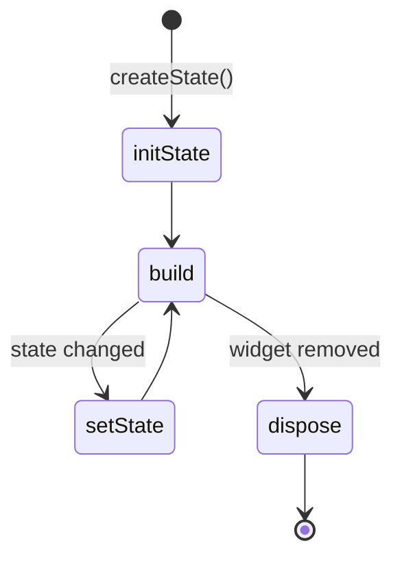

# Stateful Widgets

A `StatelessWidget` is fixed. To change what's drawn, you need a `StatefulWidget` and its `State` object.

## Anatomy

```dart
class Counter extends StatefulWidget {
  const Counter({super.key});

  @override
  State<Counter> createState() => _CounterState();
}

class _CounterState extends State<Counter> {
  int _count = 0;

  void _increment() {
    setState(() {
      _count++;
    });
  }

  @override
  Widget build(BuildContext context) {
    return Column(
      children: [
        Text('Count: $_count'),
        ElevatedButton(onPressed: _increment, child: const Text('+1')),
      ],
    );
  }
}
```

Two classes:

1. **The widget** — immutable, just a description
2. **The state** — mutable, holds the data and the build method

`_CounterState` (underscore = private to the file) holds `_count`. Calling `setState(() {...})` tells Flutter to rebuild.

## setState rules

- **Must be called for any state change** that should reflect in UI
- Only modifies state **inside** the callback (Flutter calls build after)
- Don't call setState in `build()` — infinite loop
- Don't call setState after `dispose()` — checked via `mounted`

```dart
if (mounted) {
  setState(() { _data = newData; });
}
```

## Lifecycle of a State



Methods you'll override:

```dart
class _MyState extends State<MyWidget> {
  @override
  void initState() {
    super.initState();
    // one-time setup: subscribe to streams, animation controllers
  }

  @override
  void didUpdateWidget(MyWidget oldWidget) {
    super.didUpdateWidget(oldWidget);
    // parent rebuilt with different params — react if needed
  }

  @override
  void dispose() {
    // tear down subscriptions, controllers
    super.dispose();
  }

  @override
  Widget build(BuildContext context) { ... }
}
```

## When to use StatefulWidget

Use it when the widget has **internal mutable state** that affects rendering:

- A form with TextField input
- A timer or animation
- A toggle (Switch, Checkbox)
- Tab selection
- Anything that responds to user interaction

If the widget just shows props passed in, use `StatelessWidget`.

## TextField example

```dart
class NameForm extends StatefulWidget {
  const NameForm({super.key});

  @override
  State<NameForm> createState() => _NameFormState();
}

class _NameFormState extends State<NameForm> {
  final _controller = TextEditingController();
  String _displayName = '';

  @override
  void dispose() {
    _controller.dispose();   // important — controllers must be disposed
    super.dispose();
  }

  @override
  Widget build(BuildContext context) {
    return Column(
      children: [
        TextField(
          controller: _controller,
          decoration: const InputDecoration(labelText: 'Your name'),
        ),
        const SizedBox(height: 16),
        ElevatedButton(
          onPressed: () => setState(() => _displayName = _controller.text),
          child: const Text('Show'),
        ),
        const SizedBox(height: 16),
        Text('Hello, $_displayName'),
      ],
    );
  }
}
```

## Animation example

```dart
class FadeIn extends StatefulWidget {
  final Widget child;
  const FadeIn({required this.child, super.key});

  @override
  State<FadeIn> createState() => _FadeInState();
}

class _FadeInState extends State<FadeIn> with SingleTickerProviderStateMixin {
  late final AnimationController _controller;
  late final Animation<double> _animation;

  @override
  void initState() {
    super.initState();
    _controller = AnimationController(
      duration: const Duration(seconds: 1),
      vsync: this,
    );
    _animation = CurvedAnimation(parent: _controller, curve: Curves.easeIn);
    _controller.forward();
  }

  @override
  void dispose() {
    _controller.dispose();
    super.dispose();
  }

  @override
  Widget build(BuildContext context) {
    return FadeTransition(opacity: _animation, child: widget.child);
  }
}
```

Animation controllers must be disposed. The `SingleTickerProviderStateMixin` provides the `vsync` (ties animation tick to frame rate).

## Accessing widget properties from state

In `State`, the parent widget is at `widget`:

```dart
class Greeting extends StatefulWidget {
  final String name;
  const Greeting(this.name, {super.key});

  @override
  State<Greeting> createState() => _GreetingState();
}

class _GreetingState extends State<Greeting> {
  @override
  Widget build(BuildContext context) {
    return Text('Hello, ${widget.name}');
  }
}
```

## When NOT to use setState

For state shared across many widgets, or state from network/DB, **don't** use setState — it doesn't scale. Use a state-management solution: Provider, Riverpod, or BLoC (covered in the next 3 lessons).

## Try it yourself

Build a Todo app screen:

- A `TextField` for new todo text
- An "Add" button that appends to a `List<String>`
- A `ListView.builder` showing all todos with a delete icon per row
- Counter at the top: "X items"

Use a single `StatefulWidget` for now — we'll refactor with proper state management later.

??? success "Solution"
    ```dart
    class TodoScreen extends StatefulWidget {
      const TodoScreen({super.key});

      @override
      State<TodoScreen> createState() => _TodoScreenState();
    }

    class _TodoScreenState extends State<TodoScreen> {
      final _ctrl = TextEditingController();
      final _items = <String>[];

      void _add() {
        if (_ctrl.text.trim().isEmpty) return;
        setState(() {
          _items.add(_ctrl.text.trim());
          _ctrl.clear();
        });
      }

      @override
      Widget build(BuildContext context) {
        return Scaffold(
          appBar: AppBar(title: Text('Todos (${_items.length})')),
          body: Column(
            children: [
              Padding(
                padding: const EdgeInsets.all(16),
                child: Row(
                  children: [
                    Expanded(
                      child: TextField(
                        controller: _ctrl,
                        decoration: const InputDecoration(hintText: 'New todo'),
                        onSubmitted: (_) => _add(),
                      ),
                    ),
                    const SizedBox(width: 8),
                    ElevatedButton(onPressed: _add, child: const Text('Add')),
                  ],
                ),
              ),
              Expanded(
                child: ListView.builder(
                  itemCount: _items.length,
                  itemBuilder: (_, i) => ListTile(
                    title: Text(_items[i]),
                    trailing: IconButton(
                      icon: const Icon(Icons.delete_outline),
                      onPressed: () => setState(() => _items.removeAt(i)),
                    ),
                  ),
                ),
              ),
            ],
          ),
        );
      }
    }
    ```

[← Previous](04-layout.md){ .md-button } [Next: Navigation →](06-navigation.md){ .md-button }
