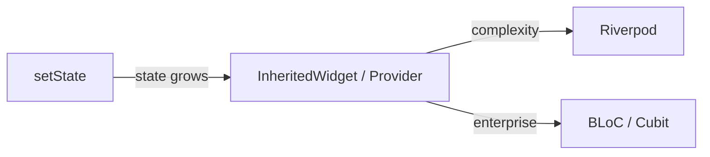

# State Management

`setState` works fine for one widget. When state needs to flow across screens or many widgets, you need something more structured.

## The spectrum



Pick based on app complexity:

| App size | Recommendation |
|---|---|
| Small (< 10 screens, no shared state) | setState |
| Medium (shared state, simple async) | Provider |
| Medium-large (newer APIs preferred) | Riverpod |
| Large (event-driven, predictable) | BLoC (next lesson) |

## Provider — gentle introduction

```bash
flutter pub add provider
```

### Define state

```dart
class CartModel extends ChangeNotifier {
  final List<String> _items = [];
  List<String> get items => List.unmodifiable(_items);

  void add(String item) {
    _items.add(item);
    notifyListeners();
  }

  void remove(String item) {
    _items.remove(item);
    notifyListeners();
  }

  int get count => _items.length;
}
```

`ChangeNotifier` is Flutter's built-in observable. `notifyListeners()` rebuilds anything watching.

### Provide it

```dart
void main() {
  runApp(
    ChangeNotifierProvider(
      create: (_) => CartModel(),
      child: const MyApp(),
    ),
  );
}
```

### Consume it

```dart
class CartBadge extends StatelessWidget {
  const CartBadge({super.key});

  @override
  Widget build(BuildContext context) {
    final count = context.watch<CartModel>().count;
    return Text('Cart: $count');
  }
}

class AddButton extends StatelessWidget {
  const AddButton({super.key});

  @override
  Widget build(BuildContext context) {
    return ElevatedButton(
      onPressed: () {
        context.read<CartModel>().add('Item ${DateTime.now()}');
      },
      child: const Text('Add to cart'),
    );
  }
}
```

| Method | Use when |
|---|---|
| `context.watch<T>()` | You want to rebuild on changes |
| `context.read<T>()` | You only need to call a method (e.g. inside `onPressed`) |
| `Selector<T, S>` | You only want to rebuild when a specific property changes |

## Multiple providers

```dart
runApp(
  MultiProvider(
    providers: [
      ChangeNotifierProvider(create: (_) => CartModel()),
      ChangeNotifierProvider(create: (_) => AuthModel()),
      Provider<ApiClient>(create: (_) => ApiClient()),
    ],
    child: const MyApp(),
  ),
);
```

## Riverpod (next-gen Provider)

Same core idea but:

- **No BuildContext required** to read state — useful in services/background tasks
- **Compile-time safe** — typos and missing providers are errors
- Better support for **async** and **caching**
- Built-in **family** modifier for parameterized providers

```bash
flutter pub add flutter_riverpod
```

```dart
final cartProvider = ChangeNotifierProvider((ref) => CartModel());

class CartBadge extends ConsumerWidget {
  @override
  Widget build(BuildContext context, WidgetRef ref) {
    final count = ref.watch(cartProvider).count;
    return Text('Cart: $count');
  }
}
```

Most new tutorials use Riverpod. Provider is still widely used and totally fine.

## Async state with FutureProvider / StreamProvider

```dart
final userProvider = FutureProvider<User>((ref) async {
  return await api.fetchUser();
});

class UserScreen extends ConsumerWidget {
  @override
  Widget build(BuildContext context, WidgetRef ref) {
    final asyncUser = ref.watch(userProvider);
    return asyncUser.when(
      loading: () => const CircularProgressIndicator(),
      error: (e, _) => Text('Error: $e'),
      data: (user) => Text(user.name),
    );
  }
}
```

The `.when` pattern is one of Riverpod's killer features — exhaustively handles all three async states in one place.

## How to choose

```
Just learning Flutter?          → setState
Building a small/medium app?    → Provider (simpler) or Riverpod (more powerful)
Building enterprise app?        → BLoC (next lesson)
```

Don't over-engineer state management at the start. You can always upgrade.

## Common mistakes

!!! warning "Watching state inside callbacks"
    ```dart
    onPressed: () {
      context.watch<X>().doSomething();  // wrong — won't rebuild even if you wanted to
    }
    ```
    Use `read` in callbacks. `watch` is for build methods.

!!! warning "Calling notifyListeners after dispose"
    Guards your ChangeNotifier with `if (!_disposed)` or use a state management library that handles this.

## Try it yourself

Refactor your Todo screen from lesson 5 to use Provider:

1. Move the list into a `TodoModel extends ChangeNotifier`
2. Wrap the app with `ChangeNotifierProvider`
3. Use `context.watch` and `context.read` in the UI
4. Add a "Clear all" button somewhere else in the app that resets the list

[← Previous](06-navigation.md){ .md-button } [Next: BLoC Pattern →](08-bloc-pattern.md){ .md-button }
