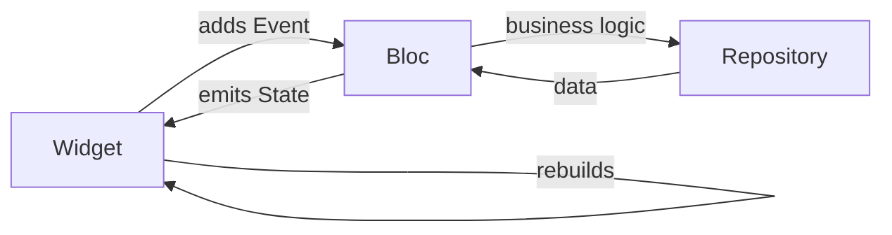

# BLoC Pattern

**BLoC** (Business Logic Component) is the de-facto enterprise state-management pattern for Flutter. It separates UI from logic by passing **events** into a Bloc and observing **states** out.



## Setup

```bash
flutter pub add flutter_bloc equatable
```

## Three pieces: Event, State, Bloc

### Event

What can happen?

```dart
sealed class CounterEvent {}

class Increment extends CounterEvent {}
class Decrement extends CounterEvent {}
class Reset extends CounterEvent {}
```

### State

What does the UI need to render?

```dart
class CounterState extends Equatable {
  final int value;
  const CounterState(this.value);

  @override
  List<Object> get props => [value];
}
```

`Equatable` lets BLoC skip rebuilds when state hasn't actually changed.

### Bloc

How do events transform state?

```dart
class CounterBloc extends Bloc<CounterEvent, CounterState> {
  CounterBloc() : super(const CounterState(0)) {
    on<Increment>((event, emit) => emit(CounterState(state.value + 1)));
    on<Decrement>((event, emit) => emit(CounterState(state.value - 1)));
    on<Reset>((event, emit) => emit(const CounterState(0)));
  }
}
```

## Provide it

```dart
BlocProvider(
  create: (_) => CounterBloc(),
  child: const MyApp(),
)
```

## Consume it

```dart
class CounterScreen extends StatelessWidget {
  const CounterScreen({super.key});

  @override
  Widget build(BuildContext context) {
    return Scaffold(
      body: Center(
        child: BlocBuilder<CounterBloc, CounterState>(
          builder: (context, state) => Text('${state.value}', style: const TextStyle(fontSize: 48)),
        ),
      ),
      floatingActionButton: Row(
        mainAxisAlignment: MainAxisAlignment.end,
        children: [
          FloatingActionButton(
            onPressed: () => context.read<CounterBloc>().add(Decrement()),
            child: const Icon(Icons.remove),
          ),
          const SizedBox(width: 8),
          FloatingActionButton(
            onPressed: () => context.read<CounterBloc>().add(Increment()),
            child: const Icon(Icons.add),
          ),
        ],
      ),
    );
  }
}
```

| Widget | Use |
|---|---|
| `BlocBuilder` | Rebuilds UI on every state change |
| `BlocListener` | Side effects (navigation, dialogs, snackbars) — doesn't rebuild |
| `BlocConsumer` | Both — combine builder + listener |
| `context.read<Bloc>()` | Add events from callbacks |

## Cubit — the simpler cousin

When you don't need explicit events (just direct methods that mutate state), use `Cubit`:

```dart
class CounterCubit extends Cubit<int> {
  CounterCubit() : super(0);

  void increment() => emit(state + 1);
  void decrement() => emit(state - 1);
  void reset() => emit(0);
}

// usage:
context.read<CounterCubit>().increment();
```

Less boilerplate; same testability. **Start with Cubit, upgrade to Bloc only if you need events for analytics/audit/etc.**

## Async events

```dart
class LoadUsers extends UsersEvent {}

class UsersBloc extends Bloc<UsersEvent, UsersState> {
  final UserRepository repo;
  UsersBloc(this.repo) : super(UsersInitial()) {
    on<LoadUsers>(_onLoadUsers);
  }

  Future<void> _onLoadUsers(LoadUsers event, Emitter<UsersState> emit) async {
    emit(UsersLoading());
    try {
      final users = await repo.fetchAll();
      emit(UsersLoaded(users));
    } catch (e) {
      emit(UsersError(e.toString()));
    }
  }
}
```

Use a `sealed class` for the states:

```dart
sealed class UsersState {}
class UsersInitial extends UsersState {}
class UsersLoading extends UsersState {}
class UsersLoaded extends UsersState {
  final List<User> users;
  UsersLoaded(this.users);
}
class UsersError extends UsersState {
  final String message;
  UsersError(this.message);
}
```

UI uses pattern matching:

```dart
BlocBuilder<UsersBloc, UsersState>(
  builder: (context, state) {
    return switch (state) {
      UsersInitial() => const Text('Tap load'),
      UsersLoading() => const CircularProgressIndicator(),
      UsersLoaded(:final users) => UserList(users),
      UsersError(:final message) => Text('Error: $message'),
    };
  },
)
```

Compiler enforces you handle every state. Massively safer than nested if/else.

## Combining Blocs

For dependencies between blocs, use `BlocListener` + add events to other blocs:

```dart
BlocListener<AuthBloc, AuthState>(
  listenWhen: (prev, next) => next is AuthLoggedOut,
  listener: (context, state) {
    context.read<CartBloc>().add(ClearCart());
    Navigator.of(context).pushReplacementNamed('/login');
  },
  child: ...,
)
```

## Testing

```dart
test('Increment increases the count', () {
  final bloc = CounterBloc();
  bloc.add(Increment());
  expectLater(bloc.stream, emits(const CounterState(1)));
});
```

`bloc_test` package gives nicer matchers for sequences of events/states.

## When BLoC, when something else

Use BLoC when:

- App is medium-to-large
- You need predictable state transitions
- You want easy testing
- Multiple teams contribute (the structure is a guardrail)

Use simpler patterns (Provider/Riverpod/setState) when:

- Solo project, < 20 screens
- Mostly form/UI state, minimal async
- You hate boilerplate

## Try it yourself

Convert your Todo screen to use a Cubit:

- `TodoCubit extends Cubit<List<Todo>>` with `add()`, `remove(id)`, `toggle(id)`
- Provide it at app root
- Use `BlocBuilder` to render the list
- Use `context.read<TodoCubit>()` from buttons

[← Previous](07-state-management.md){ .md-button } [Next: HTTP & REST →](09-http-rest.md){ .md-button }
