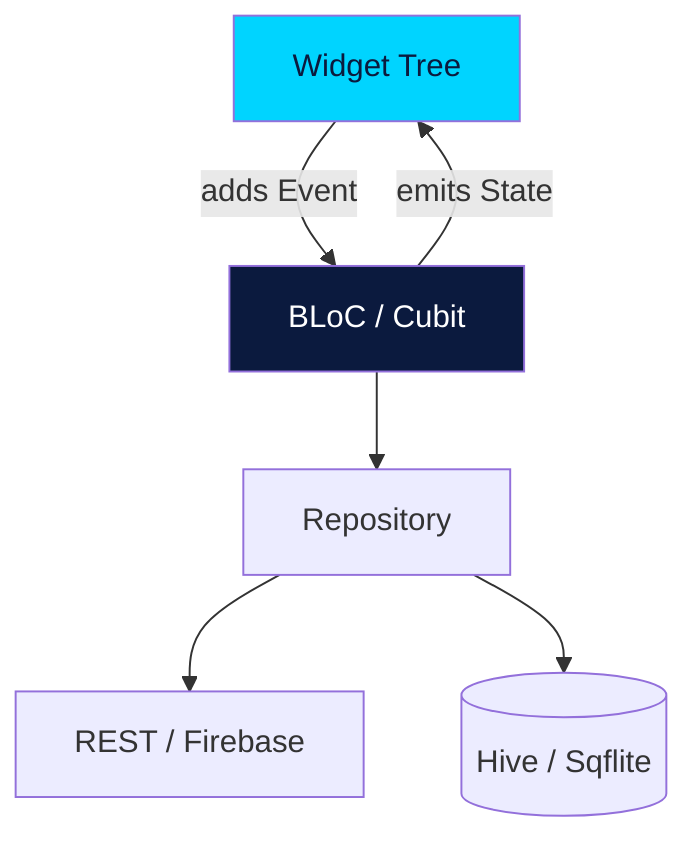

# Module 4 — Flutter

One codebase. iOS, Android, web, desktop. **Flutter** is Google's cross-platform UI toolkit and it has become the dominant choice for startups and indie devs who need to ship fast on multiple platforms without sacrificing performance.

If you went through Module 3 first, you'll appreciate how much less code Flutter requires for equivalent UIs.

## What's in this module

| # | Lesson | What you'll learn |
|---|---|---|
| 01 | [Flutter Setup](01-setup.md) | SDK install, doctor, first run |
| 02 | [Dart Essentials](02-dart-essentials.md) | Variables, null safety, async/await |
| 03 | [Widgets Intro](03-widgets-intro.md) | Everything is a widget |
| 04 | [Layout — Row, Column, Stack](04-layout.md) | Flutter's flexbox-like layout |
| 05 | [Stateful Widgets](05-stateful-widgets.md) | When state changes, UI rebuilds |
| 06 | [Navigation](06-navigation.md) | Routes, named routes, GoRouter |
| 07 | [State Management](07-state-management.md) | setState → Provider → Riverpod |
| 08 | [BLoC Pattern](08-bloc-pattern.md) | Production-grade state management |
| 09 | [HTTP & REST](09-http-rest.md) | Talking to APIs with dio |
| 10 | [Local Persistence](10-persistence.md) | SharedPreferences, Hive |
| 11 | [Firebase Intro](11-firebase.md) | Auth, Firestore, Storage |
| 12 | [Testing](12-testing.md) | Unit, widget, integration |
| 13 | [Publishing](13-publishing.md) | Play Store + App Store submission |

Then practice in **[Labs](labs.md)**.

## Prerequisites

- Either Module 1+2 (Java + Kotlin) OR a solid programming background
- Flutter SDK installed (see [Getting Started](../getting-started.md))
- 40-60 hours

## Why Dart over JavaScript?

Flutter chose Dart because:

1. **Type-safe and compiled** — fewer runtime surprises than JS
2. **Hot reload** — sub-second rebuilds without losing state
3. **AOT compilation** — production builds are native ARM code (fast)
4. **Familiar** — if you know Java/C#/Kotlin, you'll read Dart on day one

## Architecture you'll learn

The **BLoC pattern with Repository** is the production standard. Used by Google itself, large enterprises, and indie shops alike.

[Begin lesson 1 →](01-setup.md){ .md-button .md-button--primary }
