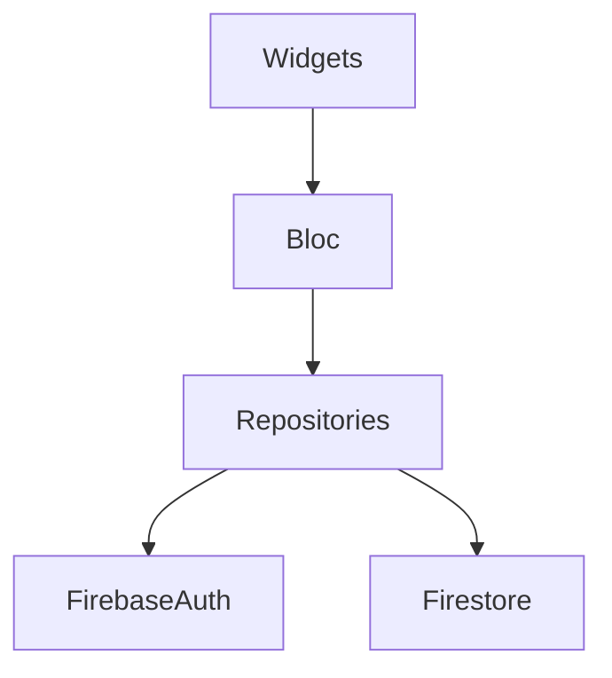

# Module 4 — Labs

Three labs of increasing complexity.

---

## Lab 1 — Counter App (warm-up)

Build a 3-screen counter app with proper structure:

- Home screen with counter, +/- buttons, reset
- Settings screen with a slider to change the step size (1, 5, 10)
- About screen with your name + version
- Use go_router for navigation
- State via Cubit
- Persistence: counter survives app restart (shared_preferences)

---

## Lab 2 — Weather App (HTTP + state)

Use the [OpenWeatherMap free API](https://openweathermap.org/api).

### Requirements

- Search by city name
- Show current temperature, condition, humidity, wind
- 5-day forecast list
- Loading + error states handled
- Save the last 5 searched cities locally (Hive or shared_prefs)
- Pull-to-refresh

### Stack

- Cubit + bloc_test
- dio for HTTP
- Hive for storage
- go_router for navigation

### Stretch

- Geolocation (request permission, auto-fetch current location weather)
- Dark mode toggle
- Multiple temperature units (C / F)

---

## Lab 3 — Social Feed (Firebase + Auth)

A simple Twitter-clone using Firebase.

### Requirements

- Auth: email/password sign up + sign in (Firebase Auth)
- Posts feed: stream from Firestore, ordered newest first
- Create post screen: text input + submit
- User profile: shows the signed-in user's posts only
- Real-time updates: a post added on one device appears on others
- Logout button

### Architecture

- One AuthRepository, one PostRepository
- AuthCubit (state: signed in/out + user)
- PostsCubit (loads feed, posts new)
- Use BlocListener to react to auth changes → navigate to login

### Stretch

- Like button (Firestore array field)
- Image upload to Firebase Storage
- Push notifications via FCM when someone likes your post
- Pagination (limit + startAfterDocument)

Submit as a public GitHub repo with README, screenshots, and a link to a deployed web build (Firebase Hosting is free).

[← Previous: Publishing](13-publishing.md){ .md-button } [Next: Module 5 — Capstone →](../05-capstone/index.md){ .md-button .md-button--primary }
