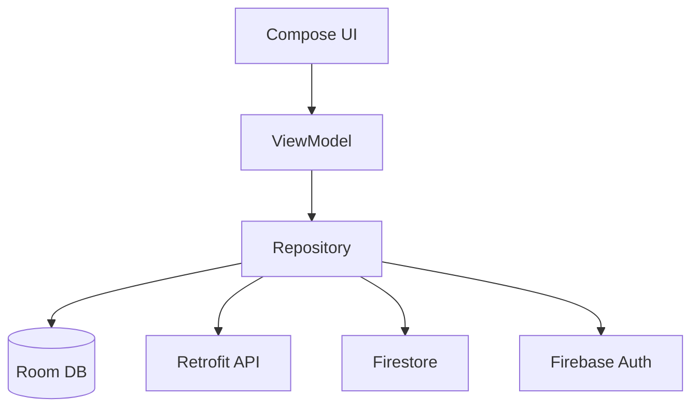

# Capstone — Android Native Project

Build **TaskMate**: a task manager with social features. Native Android, Kotlin + Jetpack Compose.

## What you'll build

A productivity app where users:

- Sign up / log in
- Create personal task lists organized by project
- Mark tasks done, with due dates and priorities
- Share a task list with friends (collaboration)
- See an activity feed of friends' completed tasks
- Get reminders for upcoming deadlines

Think Todoist meets Strava.

## Required tech

| Layer | Choice |
|---|---|
| Language | Kotlin |
| UI | Jetpack Compose + Material 3 |
| Architecture | MVVM + Repository |
| State | ViewModel + StateFlow |
| Local DB | Room |
| Network | Retrofit + Moshi |
| Auth | Firebase Auth |
| Backend | Firebase Firestore for shared lists + activity feed |
| Navigation | Navigation Compose |
| DI | Hilt (recommended) or manual |
| Testing | JUnit, MockK, Compose UI tests |

## Required screens

1. **Sign in / sign up** — email + password, password reset
2. **Home** — list of projects, FAB to create new
3. **Project detail** — list of tasks in that project, FAB to add task
4. **Task detail / edit** — title, description, due date, priority, completion
5. **Activity feed** — friends' completions, scrollable
6. **Friends** — list of friends, search by email, send/accept friend requests
7. **Settings** — theme (light/dark/system), notifications toggle, sign out

## Required architecture

- All UI in Compose, no XML except what's needed for Firebase plumbing
- Each screen has its own ViewModel
- ViewModels expose state as `StateFlow<UiState>`
- Repository pattern wraps Room + Firestore + Retrofit
- Single-source-of-truth: Room is the local cache; Firestore is the cloud truth; Repository reconciles

## Milestones

| Week | Deliverable |
|---|---|
| 1 | Project setup, Firebase config, Hilt DI, navigation skeleton with empty screens |
| 2 | Auth flow (sign up / in / out), persists across restarts |
| 3 | Local CRUD: create projects, add tasks, mark done — all in Room |
| 4 | Firestore sync: tasks/projects mirror to cloud, real-time updates |
| 5 | Friends & activity feed, sharing logic |
| 6 | Polish: animations, empty states, error UX, accessibility |
| 7 | Tests: unit + UI, Crashlytics integration |
| 8 | Release build, signed AAB, Play Store internal testing track |

## Definition of done

- ✅ Runs on Android 7+ (minSdk 24)
- ✅ No crashes on the golden path
- ✅ Survives rotation, process death, low-memory
- ✅ Works offline (Room-first; Firestore syncs when online)
- ✅ All strings externalized (`strings.xml`) — at least an English version
- ✅ Dark theme works correctly
- ✅ Accessible: TalkBack reads everything sensibly
- ✅ At least 30% code coverage on `viewmodel/` and `repository/` packages
- ✅ Published to Play Store internal testing (Production tier is optional)
- ✅ Public GitHub repo with README, screenshots, install instructions

## Stretch goals

- Push notifications via FCM for reminders
- Widget on the home screen showing today's tasks
- WearOS companion
- Tablet/foldable layouts (side-by-side projects + tasks)
- Offline-first conflict resolution

## Grading

See **[Grading Rubric](rubric.md)** for the 100-point breakdown.

## Submission

Open an issue in the course repo titled `[Capstone Submission Android] <Your Name>` with:

- Link to your public GitHub repo
- Link to APK or Play Store internal testing
- 3 screenshots
- One-paragraph description of what was hardest

[← Capstone overview](index.md){ .md-button } [Grading rubric →](rubric.md){ .md-button }
