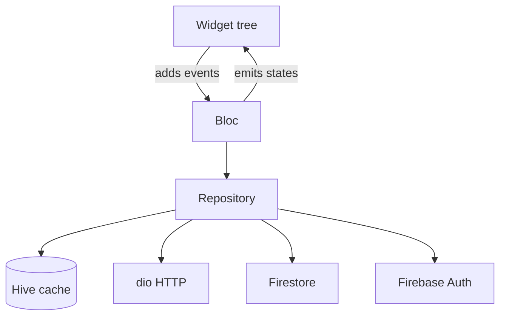

# Capstone — Flutter Project

Build **TaskMate**: a task manager with social features. Cross-platform Flutter.

Same product spec as the Android Native capstone — different tech, different platform.

## What you'll build

A productivity app where users:

- Sign up / log in
- Create personal task lists organized by project
- Mark tasks done, with due dates and priorities
- Share a task list with friends
- See an activity feed of friends' completed tasks
- Get reminders for upcoming deadlines

## Required tech

| Layer | Choice |
|---|---|
| Language | Dart |
| UI | Flutter widgets + Material 3 |
| State | BLoC (or Cubit for simpler screens) |
| Navigation | go_router |
| Local cache | Hive or Drift |
| Network | dio + json_serializable |
| Auth | Firebase Auth |
| Backend | Firebase Firestore for shared lists + activity feed |
| Secure storage | flutter_secure_storage (for tokens) |
| Testing | flutter_test + bloc_test + mocktail |

## Required screens

1. **Sign in / sign up** — email + password
2. **Home** — projects grid, FAB to create
3. **Project detail** — tasks list, FAB to add task
4. **Task detail / edit** — full form, priority, due date picker
5. **Activity feed** — friends' completions
6. **Friends** — search, requests, list
7. **Settings** — theme, notifications, sign out

## Required architecture

- Cubit for simple state (counter, toggles); Bloc for screens with rich events
- One Repository per domain (TaskRepo, FriendRepo, AuthRepo)
- Sealed-class states with exhaustive `switch` in widgets
- Local-first: read from Hive; mutate Hive; sync to Firestore in background

## Cross-platform considerations

- Target both Android and iOS minimum
- Test on at least one tablet/large screen for layout
- Web build is a stretch goal (good for marketing landing pages)

## Milestones

| Week | Deliverable |
|---|---|
| 1 | Project setup, FlutterFire config, navigation skeleton |
| 2 | Auth (sign up / in / out), persists across restarts |
| 3 | Local CRUD: projects + tasks in Hive |
| 4 | Firestore sync, real-time updates via streams |
| 5 | Friends & activity feed |
| 6 | Polish: hero animations, loading shimmers, accessibility |
| 7 | Tests: blocTest for all cubits/blocs, widget tests for key screens |
| 8 | Release builds: signed AAB for Play Store, IPA for TestFlight (if Mac) |

## Definition of done

- ✅ Runs on Android 7+ (API 24) AND iOS 14+
- ✅ No crashes on the golden path on both platforms
- ✅ Works offline; sync is graceful
- ✅ Material 3 theming, dark mode works
- ✅ Light & dark modes look intentional, not auto-derived
- ✅ Accessible: VoiceOver and TalkBack work
- ✅ At least 40% coverage; all blocs covered by `blocTest`
- ✅ Published to Play Store internal testing (TestFlight for iOS if available)
- ✅ Public GitHub repo with README, screenshots, install instructions

## Stretch goals

- Web build (deploy to Firebase Hosting — free)
- Push via FCM
- Desktop builds (Linux/macOS/Windows)
- Adaptive UI (Material on Android, Cupertino-styled on iOS)
- Offline conflict resolution (e.g., last-write-wins per-field)

## Grading

See **[Grading Rubric](rubric.md)** for the 100-point breakdown.

## Submission

Open an issue in the course repo titled `[Capstone Submission Flutter] <Your Name>` with:

- Link to your public GitHub repo
- Link to APK / TestFlight / web build
- 3 screenshots (light + dark + tablet if available)
- One-paragraph description of what was hardest

[← Capstone overview](index.md){ .md-button } [Grading rubric →](rubric.md){ .md-button }
