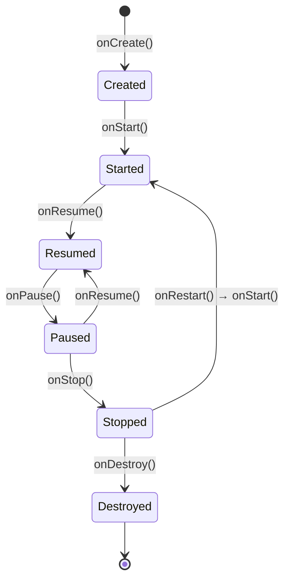
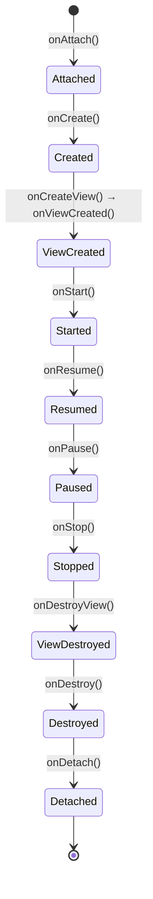
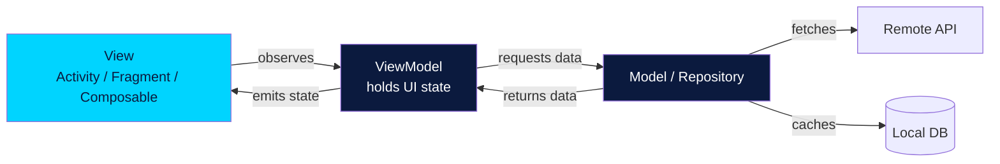
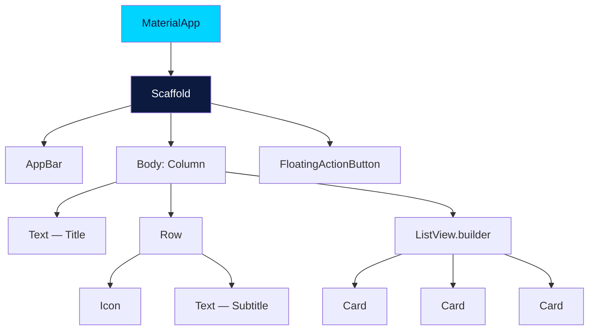
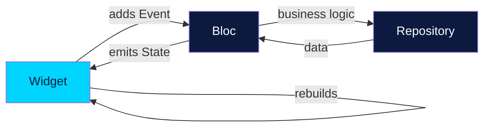
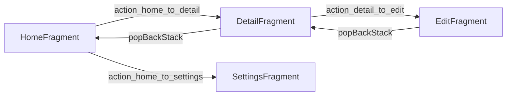
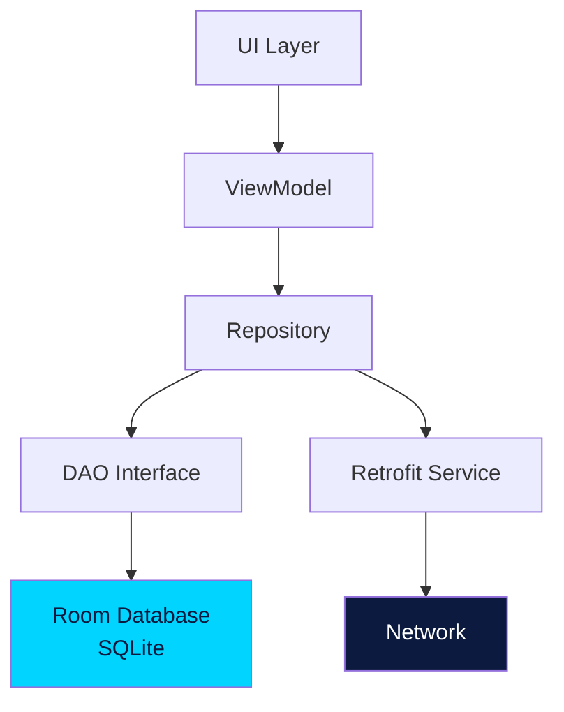
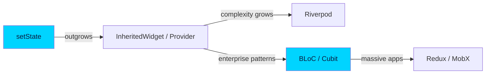
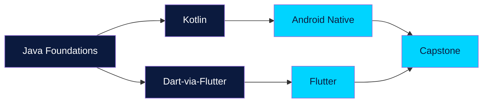

# Diagrams Reference

A consolidated view of every diagram in the course. Useful for quick visual recall before exams or interviews.

## Activity Lifecycle (Android)

## Fragment Lifecycle (Android)

## MVVM Architecture

## Flutter Widget Tree

## BLoC Pattern (Flutter)

## Navigation Component (Android)

## Room Database Layers (Android)

## State Management Spectrum (Flutter)

## Course Learning Path

