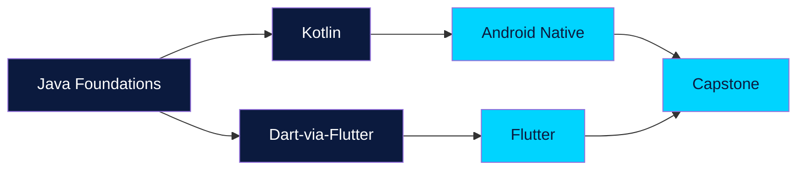

---
hide:
  - navigation
  - toc
---

  { .hero-image width=100% }

# Mobile App Development Course

**A complete, beginner-friendly course** that takes you from zero programming experience to shipping production-quality Android and Flutter apps.

This course was authored by [Mazen Tamer Salah](https://github.com/mazen-salah) — Founder of [SummationWorks](https://summationworks.com), Technical Team Lead at [UTD Software](https://utdsoftware.com) and [Clean Basket](https://clean-basket.com) — based on years of teaching and shipping real apps in production.

[Get started →](getting-started.md){ .md-button .md-button--primary }
[Browse modules](#course-modules){ .md-button }

---

## What you'll learn

By the end of this course you will:

- **Think in code** — variables, types, control flow, methods, and object-oriented programming
- **Write Kotlin idiomatically** — null safety, data classes, lambdas, collections
- **Build native Android apps** — Activities, Fragments, RecyclerView, Room, Retrofit, Jetpack Compose
- **Build cross-platform apps with Flutter** — widgets, state management with BLoC, REST APIs, Firebase
- **Ship a capstone** — design, build, test, and publish a real app to the Play Store

No prior programming experience required.

---

## Course modules { #course-modules }

{ .module-banner }
### 1. Java Foundations
Learn programming from scratch using Java. Variables, control flow, methods, arrays, strings, and the full OOP toolkit.

18 lessons · 4 labs

[Start module 1 →](01-java-foundations/index.md)

{ .module-banner }
### 2. Kotlin
Modern, expressive language used in every contemporary Android codebase. Null safety, data classes, lambdas.

12 lessons · 2 labs

[Start module 2 →](02-kotlin/index.md)

{ .module-banner }
### 3. Android Native
Build real Android apps. Activities, layouts, RecyclerView, ViewModel, Room, Retrofit, and Jetpack Compose.

13 lessons · 3 labs

[Start module 3 →](03-android-native/index.md)

{ .module-banner }
### 4. Flutter
One codebase, iOS + Android + web. Widgets, navigation, BLoC, REST, Firebase, testing, publishing.

13 lessons · 3 labs

[Start module 4 →](04-flutter/index.md)

{ .module-banner }
### 5. Capstone
Choose Android Native or Flutter — design, build, and ship a real app following the supplied rubric.

2 project briefs

[Start capstone →](05-capstone/index.md)

---

## Learning path

You can do **Android Native and Flutter in either order**. Most students prefer Android Native first (deeper OS understanding), then Flutter (faster delivery). Pick your capstone in whichever stack you enjoyed more.

---

## How to use this course

Every lesson follows the same structure:

1. **Concept** — what it is and why it matters
2. **Example** — runnable code you can paste into your editor
3. **Try it yourself** — a small exercise with hints
4. **Common mistakes** — what beginners get wrong

Lessons are bite-sized (10-30 min each). Labs at the end of each chapter ask you to combine several concepts.

---

## Contributing

This course is open source under MIT. Found a typo? A clearer explanation? A bug in a code example?
**[Open a pull request](https://github.com/mazen-salah/Mobile-application-development-course-content/pulls)** — contributions are welcome.

---

  <a href="https://github.com/mazen-salah/Mobile-application-development-course-content">⭐ Star on GitHub</a> ·
  <a href="https://summationworks.com">SummationWorks</a> ·
  <a href="https://linkedin.com/in/mazen3056">LinkedIn</a>

